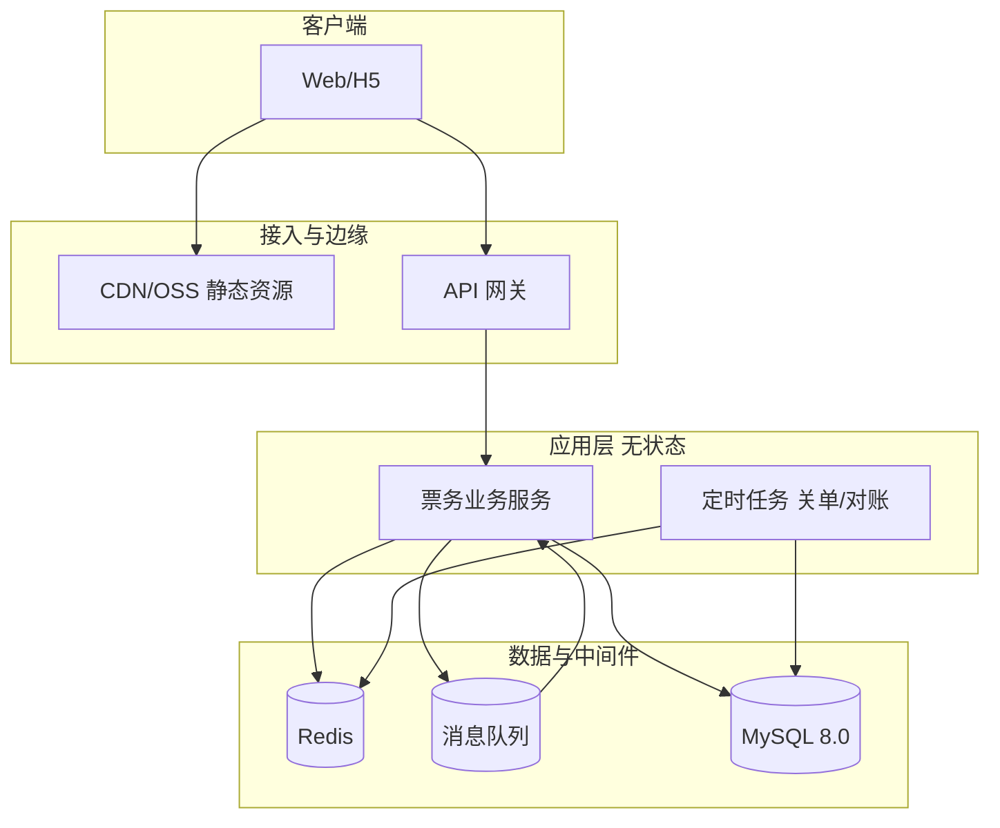

# 技术文档：高并发抢票票务平台

| 项 | 内容 |
| --- | --- |
| 文档版本 | v1.0 |
| 状态 | 草案 |
| 编写日期 | 2026-03-28 |
| 关联文档 | 《需求分析-高并发抢票票务平台.md》v2.0、《数据库设计-抢票票务平台.md》v1.0、`schema-ticket-mysql8.sql` |
| 参考规范 | 《高并发系统通用设计.md》《MySQL并发性能优化.md》《通用架构设计与代码结构规范.md》《CRUD开发流程规范.md》 |

---

## 1. 文档目的与范围

### 1.1 目的

本文档说明首期 **票档级库存、无选座** 的抢票票务平台在技术上的**总体架构、关键技术选型、核心链路设计与非功能能力**，与《需求分析》中的业务规则及《数据库设计》中的表结构一一对应，作为实现与评审的依据。

### 1.2 范围

| 包含 | 不包含（首期） |
| --- | --- |
| 分层架构、网关与流量治理思路 | 选座与座位图 |
| Redis 预扣减、MQ 异步、MySQL 权威落库 | 真实支付渠道对接与清结算 |
| 订单状态机、支付超时关单、库存释放 | 多地多活、完整反爬与风控引擎 |
| 可观测性、压测与容量**目标区间** | 具体云厂商绑定配置 |

---

## 2. 技术目标与架构原则

### 2.1 技术目标

1. **分层抗压**：让绝大部分流量在网关、缓存、内存原子操作中消化，**MySQL 不直接承载瞬时抢票峰值**（与《高并发系统通用设计》一致）。
2. **最终一致**：展示类数据（余票参考）允许短延迟；**库存不超卖、订单与票档 sold 可对账**为硬约束。
3. **无状态应用**：业务实例可水平扩展；会话与幂等依赖 Redis / DB 唯一约束。
4. **可观测**：全链路可定位单次 `order_no` / `traceId`。

### 2.2 架构原则

| 原则 | 落地 |
| --- | --- |
| 异步优先 | 抢票成功后「创建订单 + 扣 DB 库存」可走 MQ 消费，接口快速返回或返回「排队中」 |
| 幂等 | 订单号全局唯一；客户端 `idempotency_key` + DB 唯一索引；消息消费幂等键 |
| 失败可恢复 | 死信队列、关单补偿任务、库存流水 `tkt_stock_ledger` |
| 代码规范 | Maven 多模块 `*-api` / `*-server`；Controller / Service / DAL；管理端 CRUD 遵循《CRUD开发流程规范》 |

---

## 3. 总体架构

### 3.1 逻辑架构



### 3.2 请求路径分类

| 类型 | 典型接口 | 特点 |
| --- | --- | --- |
| 读多写少 | 演出列表、场次详情、票档价格 | 缓存 + 必要时读从库；余票可为近似值 |
| 写突发 | 抢票下单 | Redis Lua 预扣 → MQ → 订单落库 + `tkt_tier` 乐观更新 + 流水 |
| 写平稳 | 模拟支付、管理端 CRUD | 直连主库事务；支付成功后写 `tkt_ticket` |
| 批处理 | 超时关单、对账任务 | 扫 `order_status`+`pay_deadline`；批量小事务 |

---

## 4. 技术选型

### 4.1 后端与运行时

| 组件 | 建议选型 | 说明 |
| --- | --- | --- |
| 语言与框架 | Java 17+ + Spring Boot 3.x | 与《通用架构设计与代码结构规范》一致 |
| Web | Spring MVC | 统一异常与校验 |
| ORM | MyBatis-Plus | `BaseMapperX`、分页、`LambdaQueryWrapperX` |
| API 文档 | SpringDoc OpenAPI | 与规范中 Swagger 描述一致 |
| 校验 | Bean Validation | Controller 入参 `@Valid` |

### 4.2 中间件

| 能力 | 建议选型 | 用途 |
| --- | --- | --- |
| 缓存与原子操作 | Redis 6+ | 票档库存预扣、限流计数、热点标记 |
| 消息队列 | RocketMQ 5.x 或 Kafka | 异步建单、削峰；选型以实现成本为准 |
| 关系型数据库 | MySQL 8.0 | 权威订单与票档；脚本见 `schema-ticket-mysql8.sql` |
| 注册/配置（可选） | Nacos | 多实例配置与开关 |

### 4.3 可靠性组件

| 能力 | 建议选型 | 用途 |
| --- | --- | --- |
| 限流熔断 | Sentinel 或 Resilience4j | 网关或应用侧热点接口 |
| 定时任务 | Spring `@Scheduled` + 分布式锁（Redis） | 关单、对账，避免多实例重复执行 |
| 链路追踪 | OpenTelemetry + Jaeger/Zipkin 或 SkyWalking | 与日志 traceId 关联 |

**说明**：具体 Starter 命名（如 `{project}-spring-boot-starter-mybatis`）以实现工程为准，须与《通用架构设计与代码结构规范》模块依赖方式一致。

---

## 5. 核心业务流程

### 5.1 抢票下单（推荐路径）

```text
1. 网关：鉴权、全局限流、用户/IP 频控
2. 业务校验：开售时间、场次状态、票档上架、单人限购（可结合 Redis 计数 + DB 最终校验）
3. Redis Lua：对 key「票档可售库存」做原子扣减（扣减张数 = quantity）
   - 失败：直接返回售罄/库存不足（不访问数据库）
4. 投递 MQ：消息体含 userId、sessionId、tierId、quantity、clientRequestId/idempotencyKey、预扣凭证等
5. 同步或异步返回：
   - 同步极简路径：等待消费者创建订单后返回 order_no（延迟高，不推荐高并发）
   - 推荐：立即返回「受理成功」+ 业务令牌，客户端轮询订单结果；或短轮询 + 最终返回 order_no
6. 消费者：
   - 幂等：根据 idempotency_key 或消息唯一 ID 查重
   - 事务：插入 tkt_order（待支付）、更新 tkt_tier（sold_stock += quantity, version++）、写 tkt_stock_ledger（change_type=下单预占）
   - 失败：Redis 回滚（Lua 回补）或发补偿消息，**禁止长期只扣 Redis 不落库**
```

### 5.2 `sold_stock` 语义（与 DB 一致）

采用《数据库设计》推荐：**`sold_stock` 包含待支付已占用 + 已支付**。  
超时关单时：`sold_stock -= quantity`，写流水 `change_type=超时释放`。

### 5.3 模拟支付

```text
1. 校验订单：待支付、未过 pay_deadline
2. 本地事务：order_status=已支付，pay_channel=模拟支付，pay_time=now
3. 插入 tkt_ticket 共 quantity 行；可选再记一条 ledger（change_type=支付确认）
```

### 5.4 超时关单（定时任务）

```text
1. 扫描条件：order_status = 待支付 AND pay_deadline < now（使用索引 idx_order_pay_deadline）
2. 单条或批量处理：乐观锁更新订单 → 关闭；tkt_tier 扣回 sold_stock；ledger 记录释放
3. Redis：若仍维护票档缓存，同步回补或删除缓存由对账任务修正
```

### 5.5 订单状态机（首期）

| 当前状态 | 事件 | 下一状态 |
| --- | --- | --- |
| 待支付(10) | 支付成功 | 已支付(20) |
| 待支付(10) | 超时/取消 | 已关闭(30) |
| 已支付(20) | — | 终态（首期无退票则不变） |

非法跳转拒绝。

---

## 6. Redis 设计要点

### 6.1 Key 示例（命名需统一前缀，如 `tkt:`）

| Key 模式 | 用途 | 备注 |
| --- | --- | --- |
| `tkt:tier:stock:{tierId}` | 剩余可售张数（或可与 total-sold 对齐的语义） | 与 DB 对账；开售前置或懒加载 |
| `tkt:tier:soldout:{tierId}` | 本地/分布式标记售罄 | 可选，减少穿透 |
| `tkt:user:buy:{userId}:{sessionId}:{tierId}` | 限购计数（滑动窗口或场次维度） | 与 DB 唯一约束互补 |
| `tkt:rate:user:{userId}` | 限流令牌 | 配合网关 |

### 6.2 预扣减脚本（逻辑）

- 入参：`tierId`、`qty`、`remaining` 判断条件。  
- 原子：`GET` 剩余 ≥ `qty` 则 `DECRBY` 或维护 `remaining` 字段。  
- 返回：成功/失败码，供业务决定是否发 MQ。

### 6.3 缓存与数据一致性

- **场次详情**：Cache-Aside；更新时先写 DB 再删缓存（或延迟双删，按实现选择）。  
- **余票展示**：可读缓存；与 DB 短暂不一致时产品文案标明「仅供参考」。  
- **缓存雪崩**：TTL 加随机抖动。

---

## 7. 消息队列设计要点

### 7.1 Topic / Group 建议

| 名称 | 生产者 | 消费者 | 说明 |
| --- | --- | --- | --- |
| `tkt-order-create` | 抢票接口 | 订单服务 | 异步建单；消费者组单实例并发可配置 |
| `tkt-order-compensate` | 异常处理 | 补偿逻辑 | Redis 与 DB 不一致时回滚或告警 |

### 7.2 消息体必备字段

- `messageId` 全局唯一（便于去重表或 Redis Set）  
- `userId`、`sessionId`、`tierId`、`quantity`  
- `idempotencyKey`  
- `redisDeductToken` 或扣减版本号（用于失败回补）

### 7.3 消费失败策略

- 重试 + 指数退避；超过阈值进死信；人工或自动脚本介入。  
- **禁止**无界重试导致重复下单：依赖 DB `uk_order_no` 与幂等键。

---

## 8. MySQL 与《MySQL并发性能优化》对齐

| 主题 | 策略 |
| --- | --- |
| 热点行 | 单票档单行更新；避免在 `tkt_session` 上高频更新计数 |
| 写冲突 | `tkt_tier` 使用 `version` 或 `WHERE sold_stock + ? <= total_stock` 单条 UPDATE |
| 读扩展 | 列表/详情只读走从库；订单写走主库 |
| 慢查询 | 监控：全表扫描、锁等待；`idx_order_pay_deadline` 保障关单扫描 |
| 连接池 | HikariCP，最大连接与 DB `max_connections` 匹配 |
| 演进 | 订单表可按时间归档；分库分表按 `user_id` 或 `order_no` 路由（预留） |

---

## 9. 一致性与对账

### 9.1 目标

- **不超卖**：Redis 预扣 + DB `sold_stock` 与 `total_stock` 约束 + 订单唯一约束。  
- **不丢单**：MQ 持久化与消费者确认；失败可补偿。  
- **关单后库存可再售**：`sold_stock` 与 Redis 余量最终对齐。

### 9.2 对账任务（定时）

1. 抽样或全量比对：`tkt_tier` 的 `sold_stock` 与 `sum(有效订单占用)` + 流水汇总。  
2. 偏差：告警 + `tkt_stock_ledger` 记 `change_type=对账修正`（需权限与审计）。  
3. Redis：以 DB 为准修复或删除缓存。

---

## 10. 限流、降级与风控

| 层级 | 手段 |
| --- | --- |
| 网关 | 全局限流、按 IP/User 令牌桶 |
| 应用 | Sentinel 热点参数限流、熔断依赖下游 |
| 业务 | 未开售直接返回；售罄短路；可选验证码（Could） |
| 降级 | 非核心接口（如推荐位）关闭；详情走静态缓存 |

---

## 11. 安全

- 用户端全链路 HTTPS；鉴权 Token 与《需求分析》一致。  
- 管理端 RBAC；改价、改库存写 `tkt_admin_audit`。  
- 关键接口可加重放防护（时间戳 + 签名，可选）。  
- 日志脱敏：用户标识、订单号分级展示。

---

## 12. 可观测性

| 类型 | 内容 |
| --- | --- |
| Metrics | QPS、P50/P99、错误码分布、Redis/MQ 连接、MQ 堆积、关单批处理耗时 |
| Logging | 结构化 JSON；字段：`traceId`、`userId`、`sessionId`、`orderNo`、`tierId` |
| Tracing | 网关 → 业务 → Redis → MQ → DB 一条链 |
| 告警 | MQ 堆积超阈值、关单延迟、对账偏差、Redis/DB 连接耗尽 |

---

## 13. 容量与性能目标（学习项目参考区间）

以下数值用于**压测目标与资源规划**，非商业 SLA 承诺。

| 指标 | 参考区间 |
| --- | --- |
| 单票档抢票接口峰值 | 5k～2k QPS（视单机与 Redis 集群而定） |
| 详情读接口（缓存命中） | P99 &lt; 50ms～100ms |
| MQ 消费延迟（建单） | P99 &lt; 1s～3s（异步体验可接受范围） |
| MySQL 主库写 | 以连接池与行锁竞争为瓶颈，通过 MQ 匀速平滑 |

实际以压测报告为准，并遵循《MySQL并发性能优化》中「监控驱动、先热点后边缘」。

---

## 14. 部署与运行环境（概要）

| 环境 | 用途 |
| --- | --- |
| 本地 | Docker Compose：MySQL 8、Redis、RocketMQ/Kafka（可选） |
| 测试/预发 | 与应用同机或小集群；全链路压测 |
| 生产 | K8s 或虚拟机多实例 + 负载均衡；MySQL 主从；Redis 哨兵或集群 |

---

## 15. 模块与包结构（对齐规范）

建议业务模块名 `tkt`：

- `tkt-api`：枚举、错误码、RPC API 契约、跨模块 DTO  
- `tkt-server`：`controller/admin`、`controller/app`、`service`、`dal`、`api` 实现  

命名与分层与《通用架构设计与代码结构规范》第 2～4 章一致；管理端 CRUD 开发顺序与《CRUD开发流程规范》一致。

---

## 16. 风险与依赖

| 风险 | 缓解 |
| --- | --- |
| Redis 与 DB 双写不一致 | 对账任务 + 补偿 MQ；以 DB 为最终权威 |
| 单票档超级热点 | 合并计数、分片、本地缓存标记售罄（参考《高并发系统通用设计》） |
| MQ 积压 | 消费者扩容、限流入口、降级文案 |

---

## 17. 文档修订

| 版本 | 日期 | 说明 |
| --- | --- | --- |
| v1.0 | 2026-03-28 | 首版 |

---

**文档结束**
