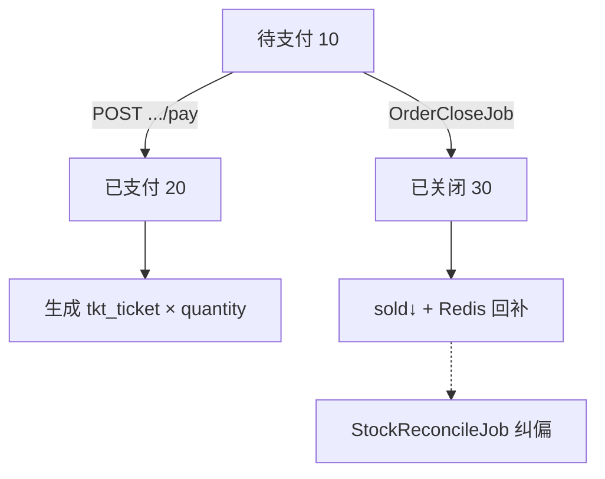
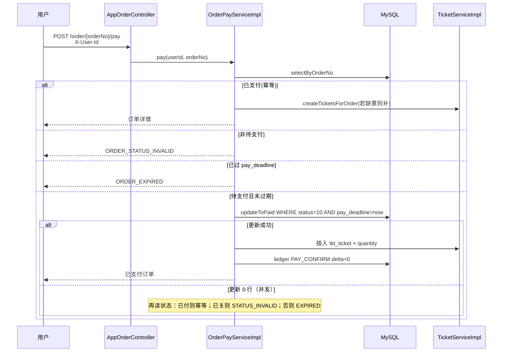
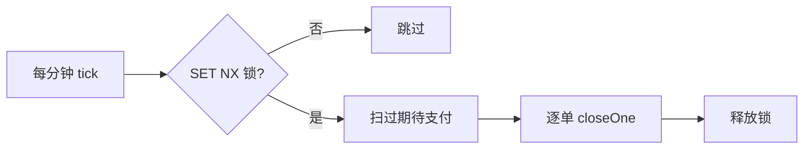
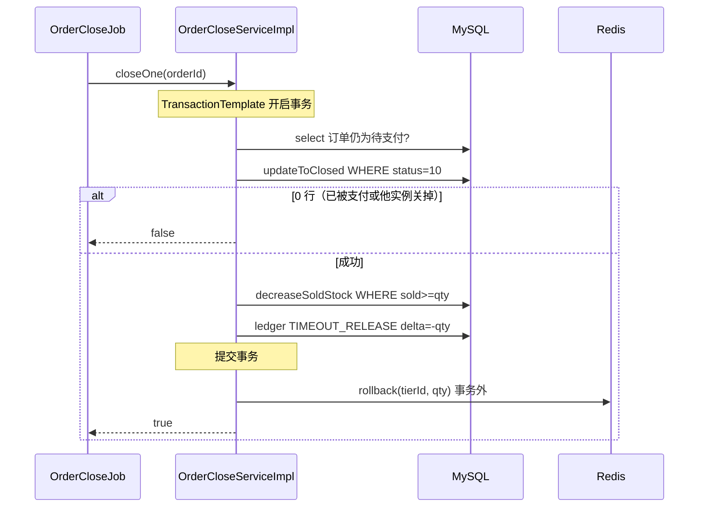

# P3/P4 讲解：模拟支付、电子票、超时关单与对账

抢票建单之后，订单进入「待支付」；用户可在截止前模拟支付并拿到电子票，超时则由定时任务关单、回退 `sold_stock` 并回补 Redis。对账 Job 定期比对票档占用与有效订单，偏差时修正并同步余量。本文件只讲 **P3/P4**，与浏览/抢票细节见《用户浏览与抢票全链路说明》。

| 项 | 内容 |
| --- | --- |
| 文档版本 | v1.0 |
| 编写日期 | 2026-07-29 |
| 代码基线 | P3 模拟支付 + 电子票；P4 超时关单 + 对账最小版 |
| 关联文档 | `docs/设计/开发计划-抢票票务平台剩余工作.md`、`docs/讲解/用户浏览与抢票全链路说明.md`、`MEMORY.md` |

---

## 1. 文档目的与边界

**目的**：结合仓库真实代码，说明支付履约与库存释放如何闭环，以及关键类、表、Redis Key、竞态处理。

**范围内**

- C 端：模拟支付、我的订单分页、我的电子票分页
- Job：超时关单、库存对账
- 与 P2 库存口径的衔接（`sold_stock` / Redis remain）

**范围外**

- 浏览、抢票预扣、建单（见全链路说明）
- 真实支付渠道、退票、选座
- P5 限流 / 压测

---

## 2. 一句话总览

```text
待支付订单
  ├─ 用户在 pay_deadline 前支付 → 已支付 + 写电子票（sold 不变）
  └─ 超时未付 → 关单 Job → sold↓ + Redis remain↑ + 流水
对账 Job：sold_stock ≟ Σ(待支付+已支付).quantity，偏差则修正并 sync Redis
```



---

## 3. 状态机与库存口径

### 3.1 订单状态

| 状态 | 值 | P3/P4 含义 |
| --- | --- | --- |
| 待支付 | 10 | 建单后进入；占用库存 |
| 已支付 | 20 | 模拟支付成功；仍占用库存；有电子票 |
| 已关闭 | 30 | 超时关单；释放占用 |
| 已退款 | 40 | 首期未用 |

### 3.2 库存口径（与 MEMORY 一致）

| 概念 | 含义 |
| --- | --- |
| `sold_stock` | **待支付占用 + 已支付** |
| Redis `tkt:tier:remain:{tierId}` | 约等于 `total_stock - sold_stock` |
| 支付成功 | **不改** `sold_stock`（建单预占已计入） |
| 超时关单 | `sold_stock -= quantity`，Redis `INCRBY` 回补 |

流水类型：

| change_type | 枚举 | 场景 | delta |
| --- | --- | --- | --- |
| 1 | ORDER_RESERVE | P2 建单预占 | +qty |
| 2 | PAY_CONFIRM | P3 支付确认 | 0 |
| 3 | TIMEOUT_RELEASE | P4 超时释放 | -qty |
| 5 | RECONCILE_FIX | P4 对账修正 | expected - actual |

---

## 4. P3｜模拟支付与电子票

### 4.1 接口一览

前缀：`/app-api/tkt`；身份：Header `X-User-Id`（首期 mock）。

| 方法 | 路径 | 说明 | 入口 |
| --- | --- | --- | --- |
| POST | `/order/{orderNo}/pay` | 模拟支付 | `AppOrderController` → `OrderPayService` |
| GET | `/order/page` | 我的订单分页 | 同上 |
| GET | `/order/get?orderNo=` | 订单详情（P2 已有） | `OrderGrabService` |
| GET | `/ticket/page` | 我的电子票分页 | `AppTicketController` → `TicketService` |

### 4.2 支付流程（代码路径）



**核心类**

| 类 | 路径 |
| --- | --- |
| `OrderPayServiceImpl` | `service/order/OrderPayServiceImpl.java` |
| `TicketServiceImpl` | `service/ticket/TicketServiceImpl.java` |
| `OrderMapper#updateToPaid` | 条件更新防并发 |
| `TicketMapper` | `selectListByOrderId` / `selectAppPage` |

### 4.3 条件更新 SQL（支付）

```sql
UPDATE tkt_order
SET order_status = 20, pay_channel = ?, pay_time = ?, update_time = NOW()
WHERE id = ? AND deleted = 0
  AND order_status = 10
  AND pay_deadline > ?;   -- 与 payTime 同一时刻，过期不可付
```

成功后字段变化：

- `order_status` → 20（已支付）
- `pay_channel` → `MOCK(1)`
- `pay_time` → now
- `sold_stock`：**不变**

### 4.4 电子票生成

`TicketServiceImpl#createTicketsForOrder`：

1. 若该 `orderId` 已有票 → 跳过（支付幂等/重试安全）
2. 否则循环 `quantity` 次插入 `tkt_ticket`
   - `ticket_no`：`TK` + 时间戳 + 随机数
   - `ticket_status`：`VALID(1)`
   - 冗余 `userId / sessionId / tierId`

### 4.5 支付确认流水

写入 `tkt_stock_ledger`：

- `change_type = PAY_CONFIRM(2)`
- `delta = 0`，`before_sold = after_sold = 当前 sold`
- 语义：审计「支付发生过」，不表示库存再占一份

### 4.6 错误码

| 错误码 | 何时 |
| --- | --- |
| `USER_ID_REQUIRED` | 缺少 `X-User-Id` |
| `ORDER_NOT_EXISTS` | 单号不存在或不属于该用户 |
| `ORDER_STATUS_INVALID` | 已关闭等不可支付状态 |
| `ORDER_EXPIRED` | 已过 `pay_deadline`，或条件更新因过期/竞态失败 |

### 4.7 本地调用示例

```bash
# 假设已有待支付订单号 ORDER_NO，用户 1001
curl -X POST "http://localhost:8080/app-api/tkt/order/ORDER_NO/pay" \
  -H "X-User-Id: 1001"

curl "http://localhost:8080/app-api/tkt/order/page?pageNo=1&pageSize=10" \
  -H "X-User-Id: 1001"

curl "http://localhost:8080/app-api/tkt/ticket/page?pageNo=1&pageSize=10" \
  -H "X-User-Id: 1001"
```

配置：`tkt.order.pay-timeout-minutes`（默认 15），建单时写入 `pay_deadline`。

---

## 5. P4｜超时关单

### 5.1 为何需要关单

建单时 Redis 已预扣、MySQL `sold_stock` 已增加。若用户不支付，不关单则：

- 票永远被「待支付」占住
- Redis 余量偏少，能卖张数变少

关单目标：**订单关闭 + DB 占用回退 + Redis 余量回补 + 可审计流水**。

### 5.2 调度与锁

| 项 | 值 |
| --- | --- |
| 类 | `OrderCloseJob` |
| Cron | `0 */1 * * * ?`（每分钟） |
| 锁 Key | `tkt:job:close-order` |
| 锁实现 | `RedisLockHelper`：`SET NX EX`，TTL 约 50s |
| 批大小 | `tkt.job.close-order.batch-size`（默认 100） |

多实例下只有拿到锁的节点执行，避免双倍释放。



### 5.3 扫描条件

`OrderMapper#selectExpiredWaitPay`：

- `order_status = 10`
- `pay_deadline < now`
- 按 `pay_deadline` 升序，`LIMIT batchSize`
- 索引：`idx_order_pay_deadline (order_status, pay_deadline)`

### 5.4 单笔关单事务

`OrderCloseServiceImpl#closeOne`：



**条件关单 SQL**

```sql
UPDATE tkt_order
SET order_status = 30, close_reason = 'timeout', update_time = NOW()
WHERE id = ? AND deleted = 0 AND order_status = 10;
```

**回退 sold**

```sql
UPDATE tkt_tier
SET sold_stock = sold_stock - ?, version = version + 1, update_time = NOW()
WHERE id = ? AND deleted = 0 AND sold_stock >= ?;
```

**Redis**：事务成功后 `INCRBY tkt:tier:remain:{tierId} quantity`。  
若 Redis 回补失败：记错误日志，依赖对账 Job 用 DB 权威值 `syncRemainFromDb` 纠偏。

### 5.5 支付 vs 关单竞态

两边都用 `WHERE order_status = 10`：

| 先成功者 | 后失败者表现 |
| --- | --- |
| 支付先成功 | 关单 `updateToClosed` 得 0 行，跳过 |
| 关单先成功 | 支付条件更新失败 → `ORDER_STATUS_INVALID` |

不会出现「已支付又关单释放」或「双倍回补」。

---

## 6. P4｜对账最小版

### 6.1 问题场景

极端情况下可能出现：

- 关单 DB 成功但 Redis 回补失败 → remain 偏小
- 其他异常导致 `sold_stock` 与有效订单合计不一致

### 6.2 规则

对每个票档：

```text
expected = SUM(quantity) FROM tkt_order
           WHERE tier_id = ? AND order_status IN (10, 20) AND deleted = 0
actual   = tkt_tier.sold_stock

若 expected ≠ actual：
  1) UPDATE sold_stock = expected
  2) 写 RECONCILE_FIX 流水
  3) Redis SET remain = total_stock - sold_stock
```

### 6.3 调度

| 项 | 值 |
| --- | --- |
| 类 | `StockReconcileJob` |
| Cron | `0 */5 * * * ?`（每 5 分钟） |
| 锁 Key | `tkt:job:reconcile` |
| 开关 | `tkt.job.reconcile.enabled`（默认 true） |

实现：`StockReconcileServiceImpl` + `OrderMapper#sumActiveQuantityByTierId` + `TierStockRedisService#syncRemainFromDb`。

> 首期为全表票档扫描，数据量大时需按场次/热点票档收敛，属后续优化。

---

## 7. 关键类与文件索引

```text
controller/app/order/AppOrderController.java     # pay / page
controller/app/ticket/AppTicketController.java   # ticket page
service/order/OrderPayServiceImpl.java           # 支付编排
service/order/OrderCloseServiceImpl.java         # 关单编排
service/ticket/TicketServiceImpl.java            # 电子票
service/stock/StockReconcileServiceImpl.java     # 对账
service/stock/TierStockRedisServiceImpl.java     # rollback / syncRemainFromDb
job/OrderCloseJob.java
job/StockReconcileJob.java
redis/RedisLockHelper.java
redis/TktRedisKeys.java                          # jobCloseOrder / jobReconcile
dal/mysql/order/OrderMapper.java                 # updateToPaid / updateToClosed / selectExpired*
dal/mysql/tier/TierMapper.java                   # decreaseSoldStock / updateSoldStock
```

---

## 8. 数据落点对照

| 动作 | MySQL | Redis |
| --- | --- | --- |
| 支付成功 | `tkt_order`→20；`tkt_ticket`×N；ledger PAY_CONFIRM | 无 |
| 超时关单 | `tkt_order`→30；`sold_stock`↓；ledger TIMEOUT_RELEASE | `remain`↑ |
| 对账修正 | `sold_stock`=expected；ledger RECONCILE_FIX | `remain` SET 为 total−sold |

---

## 9. 验收清单

### P3

- [ ] 待支付且未过期：支付后状态 20，`pay_channel=MOCK`，电子票张数 = quantity
- [ ] 重复支付：幂等成功，不重复插票（或已有票跳过）
- [ ] 过期未关单前支付：返回 `ORDER_EXPIRED`
- [ ] 他人订单 / 无 Header：`ORDER_NOT_EXISTS` / `USER_ID_REQUIRED`
- [ ] 我的订单、我的电子票分页可按用户过滤

### P4

- [ ] 将 `pay-timeout-minutes` 调为 1，建单后等待：订单变 30，`close_reason=timeout`
- [ ] 关单后同票档可再次抢到（Redis remain / sold 已回退）
- [ ] 有 `TIMEOUT_RELEASE` 流水
- [ ] 两实例同时跑：关单不双倍释放（锁 + 条件更新）
- [ ] 人为改乱 `sold_stock` 后等对账：被纠正并同步 Redis

---

## 10. 与上下游文档关系

| 文档 | 关系 |
| --- | --- |
| 《用户浏览与抢票全链路说明》 | P0～P2 浏览/抢票；本文补支付关单细节 |
| 《开发计划》§P3/P4 | 分期目标与验收；进度已标完成 |
| 《设计文档》§5.2 / §5.3 | 产品设计原文；本文对齐落地代码 |

下一步通常是 **P5：限流、观测与压测**，使峰值流量主要停在 Redis/MQ。

---

## 11. 修订记录

| 版本 | 日期 | 说明 |
| --- | --- | --- |
| v1.0 | 2026-07-29 | 首版：结合 P3/P4 代码讲解支付、电子票、关单、对账 |

---

**文档结束**
