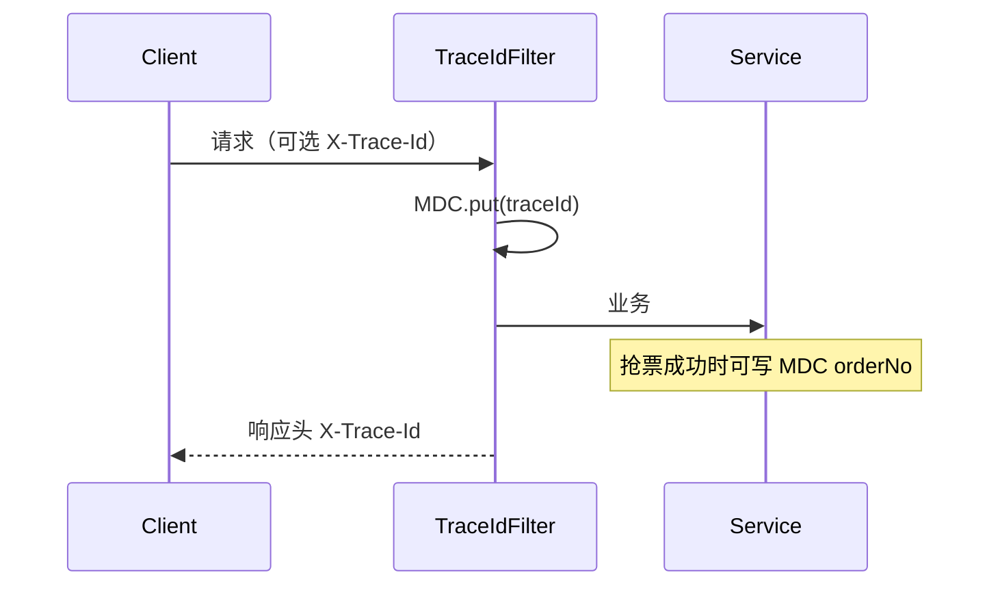

# P5 讲解：限流、观测与本地压测

首期主链路（抢票 → 支付/关单）跑通后，本阶段补齐「可演示的治理能力」：抢票限流、请求 traceId、核心业务指标，以及一份可本地执行的 k6 压测脚本。网关与管理端审计落库仍为后续增强项。

| 项 | 内容 |
| --- | --- |
| 文档版本 | v1.0 |
| 编写日期 | 2026-07-29 |
| 代码基线 | Resilience4j 抢票限流、MDC traceId、Micrometer/Prometheus、管理端 Token、k6 脚本 |
| 关联文档 | `docs/设计/开发计划-抢票票务平台剩余工作.md`、`docs/讲解/用户浏览与抢票全链路说明.md` |

---

## 1. 能力一览

| 能力 | 实现 | 配置 / 入口 |
| --- | --- | --- |
| 抢票限流 | Resilience4j `RateLimiter`（`GrabRateLimitService`） | `tkt.rate-limit.*`；超限 `RATE_LIMIT_EXCEEDED` |
| traceId | `TraceIdFilter` → MDC + 响应头 `X-Trace-Id` | 日志 pattern 含 `%X{traceId}` |
| 业务指标 | `TktMetrics`（预扣/建单/关单） | `/actuator/prometheus`、`/actuator/metrics` |
| 管理端鉴权 | `AdminAuthInterceptor` 校验 `X-Admin-Token` | `tkt.admin.*`；探活 `/ping` 放行 |
| 压测脚本 | `scripts/k6/grab.js` | 见下文 |

---

## 2. 限流（5.1）

### 行为

- 仅拦截业务入口：`OrderGrabServiceImpl.grab` 开头调用 `grabRateLimitService.checkPermit()`
- 默认：**每 1 秒最多 100 次**全局限流（演示用，非按用户分片）
- 超限：`throw exception(RATE_LIMIT_EXCEEDED)` → `code=1010005001`

### 配置

```yaml
tkt:
  rate-limit:
    enabled: true
    limit-for-period: 100
    limit-refresh-period-seconds: 1
```

压测前可将 `limit-for-period` 调大，或 `enabled: false`。

### 类路径

- `module/tkt/config/RateLimitConfig.java`
- `module/tkt/service/ratelimit/GrabRateLimitService.java`

---

## 3. traceId 与日志（5.4）



- 无请求头时自动生成 UUID（去横线）
- 控制台日志格式：`[traceId=...] [orderNo=...]`
- Filter：`framework/web/TraceIdFilter.java`

---

## 4. 核心指标（5.5）

| Meter 名 | 标签 | 含义 |
| --- | --- | --- |
| `tkt.deduct` | `result=success\|sold_out\|not_ready` | Redis 预扣结果 |
| `tkt.order_create` | `result=success\|fail` | 建单结果 |
| `tkt.order_create_latency` | Timer | 建单耗时 |
| `tkt.order_close` | `result=success` | 关单成功笔数 |

查看：

```bash
curl http://localhost:8080/actuator/prometheus | findstr tkt_
# 或
curl http://localhost:8080/actuator/metrics/tkt.deduct
```

埋点位置：`TierStockRedisServiceImpl`、`OrderCreateServiceImpl`、`OrderCloseServiceImpl`。

---

## 5. 管理端 Token（5.2）

```yaml
tkt:
  admin:
    auth-enabled: true
    token: dev-admin-token
```

请求头：`X-Admin-Token: dev-admin-token`  
失败：`ADMIN_UNAUTHORIZED`（`1010008000`）  
关闭校验：`auth-enabled: false`  
`/admin-api/tkt/ping` 不校验。

---

## 6. 本地压测（5.6）

### 前置

1. `docker compose up -d` 且应用已启动（profile `local` 可选）
2. 确认场次开售、票档有库存（seed 或管理端造数）
3. 安装 [k6](https://k6.io/docs/get-started/installation/)
4. 压测时建议调高/关闭限流，否则大量 `1010005001`

### 命令

```bash
k6 run ^
  -e BASE_URL=http://localhost:8080 ^
  -e SESSION_ID=1 ^
  -e TIER_ID=1 ^
  -e USER_ID=1001 ^
  scripts/k6/grab.js
```

脚本默认：约 **50 req/s × 30s**，多用户轮换 `X-User-Id`，每次独立幂等键。

### 观察点

| 观察 | 期望 |
| --- | --- |
| MySQL | 峰值应主要停在 Redis 预扣；DB 为建单/落库 |
| Prometheus | `tkt_deduct_*`、`tkt_order_create_*` 增长 |
| 日志 | 带同一 `traceId` 可串起请求 |
| 限流开启时 | 部分响应 `code=1010005001` |

---

## 7. 验收清单

- [ ] 高频抢票触发限流，返回「请求过于频繁」
- [ ] 响应头有 `X-Trace-Id`，日志可检索
- [ ] `/actuator/prometheus` 可见 `tkt_*` 指标
- [ ] 无 Token 访问管理端写/读业务接口失败；带 `dev-admin-token` 成功
- [ ] 按上文跑通一轮 k6，有成功/售罄/限流分布

---

## 8. 明确未做（P5 本期）

- Sentinel 控制台 / 按用户维度限流
- 管理端操作审计落 `tkt_admin_audit`
- 独立 API 网关

---

## 9. 修订记录

| 版本 | 日期 | 说明 |
| --- | --- | --- |
| v1.0 | 2026-07-29 | 首版：P5 限流、观测、鉴权、k6 |

---

**文档结束**
