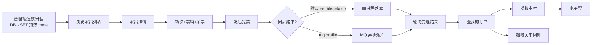
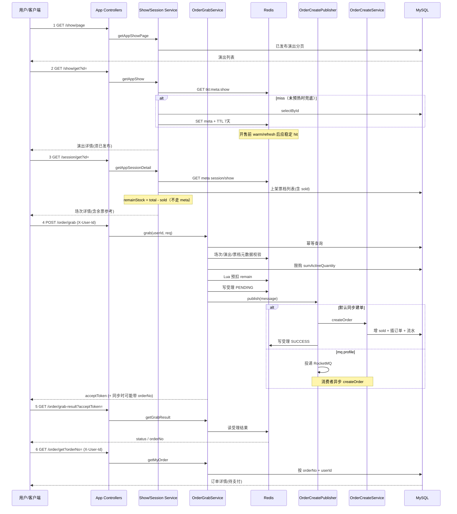
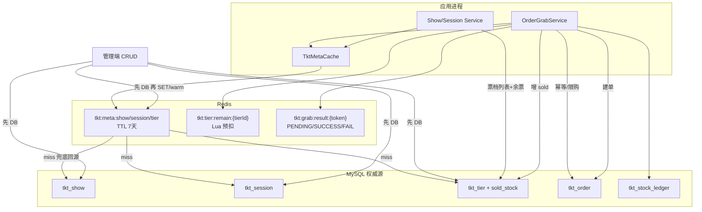
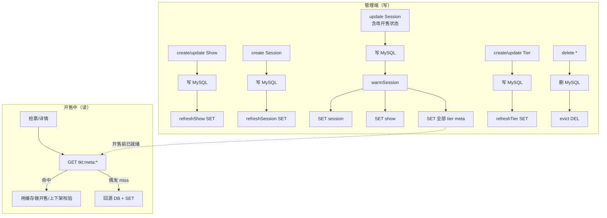
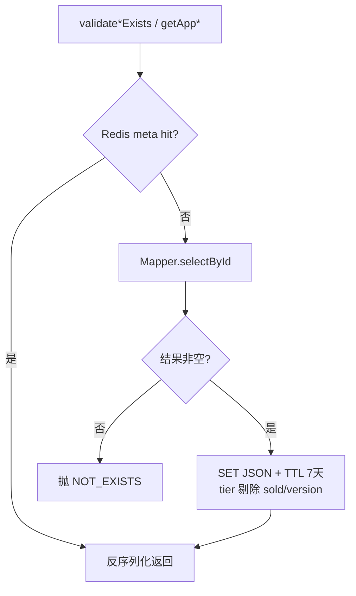
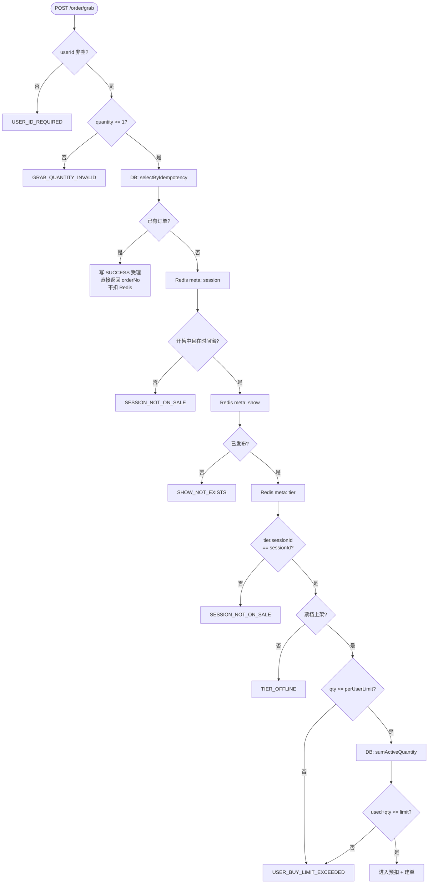
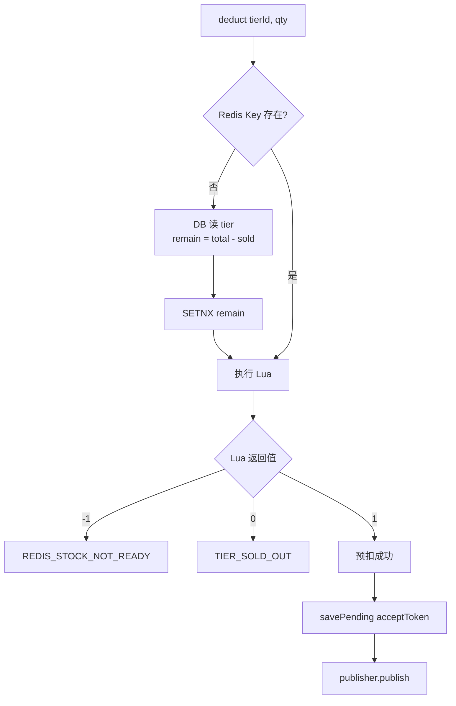
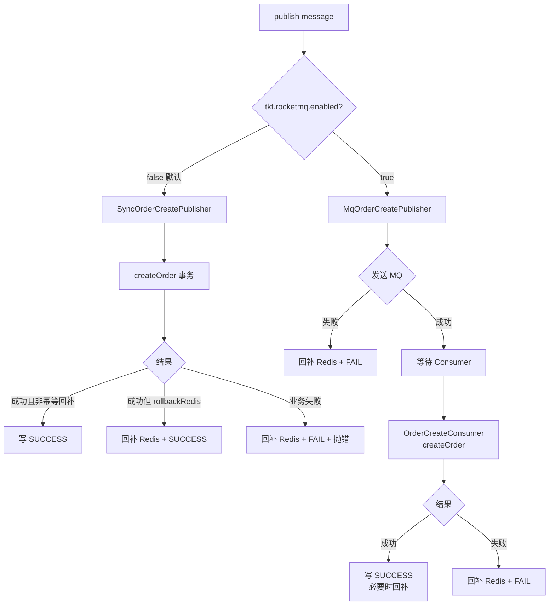
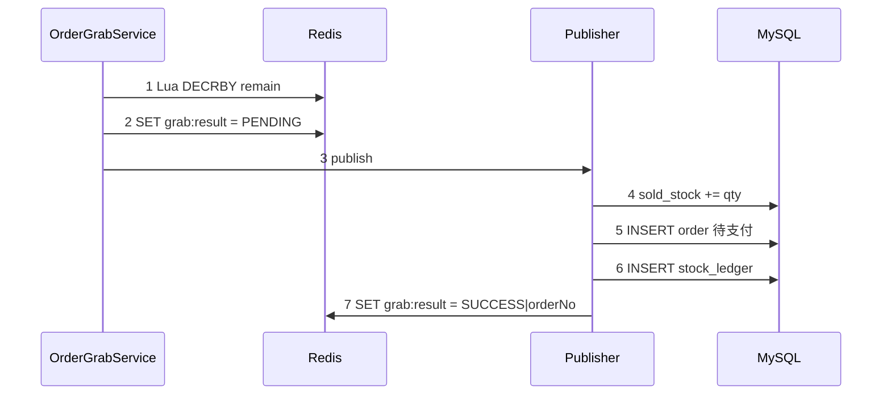
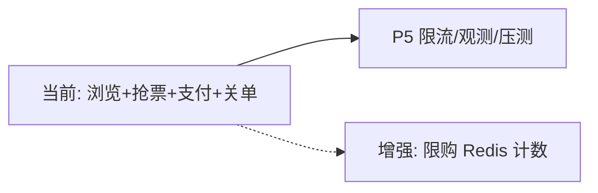

# 用户浏览与抢票全链路说明（结合代码）

用户先浏览已发布演出与场次票档，开售时带着幂等键发起抢票：系统用 Redis 中预热好的元数据做开售/上下架校验，用 Lua 预扣余票并返回受理令牌，再同步或经 MQ 异步落库（增 `sold_stock`、写待支付订单与流水），客户端轮询受理结果后可模拟支付生成电子票；超时未付由关单 Job 回退 `sold_stock` 并回补 Redis，对账 Job 纠偏库存偏差。整条链路以 MySQL 为权威数据，Redis 扛元数据读与库存闸门。

| 项 | 内容 |
| --- | --- |
| 文档版本 | v1.7 |
| 编写日期 | 2026-07-29 |
| 代码基线 | P0～P4 + Redis 元数据预热 + Redis 库存预扣 + 建单 + 模拟支付/电子票 + 超时关单/对账 |
| 关联代码 | `controller/app/**`、`TktMetaCache`、`OrderGrabServiceImpl`、`OrderPayServiceImpl`、`OrderCloseServiceImpl`、`StockReconcileServiceImpl`、`TierStockRedisServiceImpl`、`OrderCreateServiceImpl` |

---

## 1. 文档目的

用**当前仓库真实实现**说明：用户从「看演出 → 看场次票档 → 抢票 → 轮询拿单 → 查订单」走了哪些接口、进了哪些类、数据落在 **Redis / MySQL** 的哪里。

- **开售前**：管理端落库后把演出/场次/票档元数据 **SET 进 Redis**（场次更新会 `warmSession` 一并预热），开售中读元数据应稳定命中，**不是**每几十秒过期回源。
- P3/P4 已落地：模拟支付、电子票、超时关单、对账最小版；专项讲解见 `docs/讲解/P3P4-支付关单与对账讲解.md`。
- 默认配置：`tkt.rocketmq.enabled=false`（进程内**同步建单**）；开启 `mq` profile 后走 RocketMQ 异步。

---

## 2. 用户旅程总览

### 2.1 阶段鸟瞰



### 2.2 端到端时序



---

## 3. 缓存分层（当前实现）

开售高峰下，读路径按职责拆成三层，**不要混用**：

| 层 | 载体 | 存什么 | 不存什么 | 失效 |
| --- | --- | --- | --- | --- |
| 元数据 | Redis（`TktMetaCache`） | `tkt:meta:show/session/tier`：状态、开售窗、价格、限购上限等 | 余票、`sold_stock`、`version` | 管理端 **先 DB 再 SET**（预热）；删除则 DEL；TTL 默认 **7 天** |
| 库存闸门 | Redis | `tkt:tier:remain:{tierId}` 可售余量 | 业务规则全文 | Lua DECR；失败/幂等回补 INCR |
| 受理结果 | Redis | `tkt:grab:result:{token}` | — | TTL 默认 30 分钟 |

配置：

| 配置项 | 含义 | 默认 |
| --- | --- | --- |
| `tkt.cache.meta-ttl-seconds` | 元数据 Redis TTL | 604800（7 天） |
| `tkt.grab.result-ttl-minutes` | 受理结果 TTL | 30 |
| `tkt.grab.async-poll-seconds` | 建议轮询间隔 | 1 |

### 3.1 分层架构图



### 3.2 元数据 API 与写路径

| 方法 | 时机 | 行为 |
| --- | --- | --- |
| `getShow/getSession/getTier` | C 端读 / 抢票校验 | Redis GET；miss 则查 DB 并 SET |
| `refreshShow/Session/Tier` | 管理端 create/update 后 | 从 DB 读最新 → **SET**（票档剔除 sold/version） |
| `warmSession(sessionId)` | **场次 update 后** | SET 场次 + 所属演出 + 该场次全部票档（开售前预热主入口） |
| `evict*` | 管理端 delete 后 | **DEL** Key |



### 3.3 元数据读路径（含 miss 兜底）



**约定小结：**

- 权威源永远是 **MySQL**；Redis 是配置快照，不是「先 Redis 后刷库」。
- TTL **7 天**只防 Key 永久堆积；正常靠管理端 **SET 覆盖 / delete 时 DEL**，**不是**靠短过期逼回源。
- 开售前务必至少 **update 一次场次**（或保证 create/update 路径已 refresh），让 `warmSession`/`refresh*` 把 meta 刷进 Redis。

**为何余票不进元数据：** 场次详情的 `remainStock` 必须反映 DB `sold_stock`；真正防超卖靠 Redis Lua + 建单条件更新。管理端票档详情/改库存校验直查 DB。

---

## 4. 阶段一：浏览目录（只读）

### 4.0 浏览流程图


### 4.1 演出列表

| 项 | 内容 |
| --- | --- |
| 接口 | `GET /app-api/tkt/show/page` |
| Controller | `AppShowController` |
| Service | `ShowServiceImpl#getAppShowPage` |
| Mapper | `ShowMapper#selectAppPage` |

**规则**：强制 `status = 已发布(1)`，草稿/下架不会出现在 C 端列表。列表分页**不走**元数据缓存（条件查询，直查 DB）。

### 4.2 演出详情

| 项 | 内容 |
| --- | --- |
| 接口 | `GET /app-api/tkt/show/get?id=` |
| Service | `ShowServiceImpl#getAppShow` → `validateShowExists` → `TktMetaCache#getShow` |

**规则**：不存在或未发布 → `SHOW_NOT_EXISTS`。点查走 Redis 元数据。

### 4.3 场次详情（含票档与余票）

| 项 | 内容 |
| --- | --- |
| 接口 | `GET /app-api/tkt/session/get?id=` |
| Service | `SessionServiceImpl#getAppSessionDetail` |

核心逻辑：

1. **场次 / 所属演出**：`validateSessionExists` / `validateShowExists` → Redis `tkt:meta:*`（TTL 7 天；管理端变更时 SET/warm）。
2. 所属演出必须已发布，否则当「场次不可见」（`SESSION_NOT_EXISTS`）。
3. **票档列表 + 余票**：`TierMapper#selectListBySessionId` **直查 DB**，只返回上架票档；`remainStock = max(totalStock - soldStock, 0)`。

> 余票与 Redis 预扣可能有短延迟，产品上视为「仅供参考」。

管理端改场次会 `warmSession`（场次+演出+票档 SET）；改票档会 `refreshTier`。删除则 DEL。

---

## 5. 阶段二：发起抢票

### 5.1 入口

| 项 | 内容 |
| --- | --- |
| 接口 | `POST /app-api/tkt/order/grab` |
| Header | `X-User-Id`（首期 mock 登录） |
| Body | `sessionId`、`tierId`、`quantity`、`idempotencyKey`（必填） |
| Controller | `AppOrderController#grab` |
| 编排 | `OrderGrabServiceImpl#grab` |

### 5.2 校验顺序（if + 错误码）

对应 `OrderGrabServiceImpl#grab`：

| 顺序 | 校验 | 数据来源 | 失败错误码 |
| --- | --- | --- | --- |
| 1 | `userId` 非空 | 本地 | `USER_ID_REQUIRED` |
| 2 | `quantity >= 1` | 本地 | `GRAB_QUANTITY_INVALID` |
| 3 | 幂等键已存在订单 | MySQL | **直接成功返回**（不重扣库存） |
| 4 | 场次存在 | Redis 元数据 | `SESSION_NOT_EXISTS` |
| 5 | 场次开售中 + 在开售时间窗内 | 同上（缓存中的 session） | `SESSION_NOT_ON_SALE` |
| 6 | 演出已发布 | Redis 元数据 | `SHOW_NOT_EXISTS` |
| 7 | 票档属于该场次 | Redis 元数据 | `SESSION_NOT_ON_SALE` |
| 8 | 票档上架 | Redis 元数据 | `TIER_OFFLINE` |
| 9 | 本单数量 ≤ `perUserLimit` | 同上（tier 字段） | `USER_BUY_LIMIT_EXCEEDED` |
| 10 | 已占用张数(待支付+已支付) + 本单 ≤ 限购 | MySQL `sumActiveQuantity` | `USER_BUY_LIMIT_EXCEEDED` |

限购统计见 `OrderMapper#sumActiveQuantity`（`order_status IN (10,20)`）。**尚未**做 Redis 限购计数，高并发下该步仍可能打库。

### 5.2.1 校验决策流



### 5.3 组装建单消息

生成 `acceptToken`（UUID，去掉横线），同时作为：

- 客户端轮询令牌
- 消息 `messageId`
- Redis 受理结果 Key 的一部分

消息体 `OrderCreateMessage` 含：`userId/sessionId/tierId/quantity/unitPriceCent/idempotencyKey`。

### 5.4 Redis Lua 预扣

类：`TierStockRedisServiceImpl`。

**Key**：`tkt:tier:remain:{tierId}`

**初始化（懒加载）**：

- Key 不存在时，从 DB 读票档，`remain = totalStock - soldStock`，`SETNX` 写入。

**Lua 语义**：

| 返回值 | 含义 | 业务处理 |
| --- | --- | --- |
| `-1` | Key 仍未就绪 | `REDIS_STOCK_NOT_READY` |
| `0` | 余量不足 | `TIER_SOLD_OUT` |
| `1` | `DECRBY` 成功 | 继续 |

预扣成功后再写受理结果 `PENDING`，再 `publish`。

这样**库存高峰与元数据读**都尽量卡在 Redis，减少无效打库。

### 5.4.1 预扣流程图



---

## 6. 阶段三：建单落库

### 6.1 发布抽象

接口：`OrderCreatePublisher`

| 实现 | 条件 | 行为 |
| --- | --- | --- |
| `SyncOrderCreatePublisher` | `tkt.rocketmq.enabled=false`（默认） | 同进程调用 `OrderCreateService#createOrder` |
| `MqOrderCreatePublisher` | `enabled=true` | `RocketMQTemplate` 发到 `TKT_ORDER_CREATE`；`OrderCreateConsumer` 消费 |

### 6.1.1 同步 vs MQ



同步路径在 `SyncOrderCreatePublisher` 内：

- 成功 → 写受理 `SUCCESS(orderNo)`；若 `rollbackRedis=true`（幂等命中）则回补 Redis
- `ServiceException` → 回补 Redis + 写受理 `FAIL` + 抛出

### 6.2 事务建单

类：`OrderCreateServiceImpl#createOrder`（`@Transactional`）

```text
1. 再查幂等：已有订单 → CreateOrderResult(orderNo, rollbackRedis=true)
2. 读票档；increaseSoldStock（条件：sold+qty <= total）
   - 影响行数 0 → TIER_SOLD_OUT
3. 插入 tkt_order（待支付、pay_deadline = now + 配置分钟）
   - 唯一键冲突 → 事务标记回滚，返回已有单 + rollbackRedis=true
4. 写 tkt_stock_ledger（change_type = 下单预占）
5. 返回 CreateOrderResult(orderNo, rollbackRedis=false)
```

### 6.2.1 建单与库存对齐


**库存口径**：

- Redis `remain`：可售张数  
- MySQL `sold_stock`：已占用（含待支付）  
- 预扣成功后 DB `sold` 增加，两边语义对齐；失败路径必须 `rollback` Redis。

### 6.3 抢票接口返回

`AppOrderGrabRespVO`：

| 字段 | 含义 |
| --- | --- |
| `acceptToken` | 轮询令牌 |
| `pollSeconds` | 建议轮询间隔（配置 `tkt.grab.async-poll-seconds`） |
| `orderNo` | 默认同步建单成功时往往已有值；纯异步时可能为空，需轮询 |

---

## 7. 阶段四：轮询与查单

### 7.0 客户端轮询流


### 7.1 轮询受理结果

| 项 | 内容 |
| --- | --- |
| 接口 | `GET /app-api/tkt/order/grab-result?acceptToken=` |
| 存储 | Redis `tkt:grab:result:{token}` |
| 协议 | `status\|orderNo\|errorCode\|errorMsg`（见 `GrabResultServiceImpl`） |

| status | 含义 |
| --- | --- |
| 0 | 处理中（PENDING） |
| 1 | 成功（SUCCESS，可读 orderNo） |
| 2 | 失败（FAIL，可读错误码/文案） |

TTL：`tkt.grab.result-ttl-minutes`（默认 30 分钟）。过期 → `GRAB_RESULT_NOT_EXISTS`。

### 7.2 查询我的订单

| 项 | 内容 |
| --- | --- |
| 接口 | `GET /app-api/tkt/order/get?orderNo=` |
| Header | `X-User-Id` |

必须 `order.userId == header 用户`，否则 `ORDER_NOT_EXISTS`（避免越权窥探）。

当前订单在支付后为 **已支付(20)** 并写入电子票；未支付超时由 `OrderCloseJob` 关单释放库存。

---

## 8. 关键数据流一览

| 存储 | Key / 表 | 谁写 | 谁读 |
| --- | --- | --- | --- |
| Redis | `tkt:meta:show/session/tier` | 管理端先 DB 再 SET/warm；delete 则 DEL；miss 回源 | `validate*Exists`、场次详情（场次/演出） |
| Redis | `tkt:tier:remain:{tierId}` | 预扣 DECR / 失败 INCR / 懒加载 SETNX | Lua |
| Redis | `tkt:grab:result:{token}` | Publisher / Consumer | 轮询接口 |
| MySQL | `tkt_order` | `OrderCreateServiceImpl` | 幂等、限购、查单 |
| MySQL | `tkt_tier`（列表含 `sold_stock`） | 建单增 sold；管理端改元数据 | 场次详情余票、对账 |
| MySQL | `tkt_stock_ledger` | 建单事务 | 审计/对账（P4） |

### 8.1 成功抢票时写入顺序



---

## 9. 客户端推荐调用示例

```http
### 1. 列表
GET /app-api/tkt/show/page?pageNo=1&pageSize=10

### 2. 详情
GET /app-api/tkt/show/get?id=1

### 3. 场次+票档
GET /app-api/tkt/session/get?id=1

### 4. 抢票
POST /app-api/tkt/order/grab
X-User-Id: 10001
Content-Type: application/json

{
  "sessionId": 1,
  "tierId": 1,
  "quantity": 1,
  "idempotencyKey": "client-10001-req-001"
}

### 5. 轮询（异步或未带上 orderNo 时）
GET /app-api/tkt/order/grab-result?acceptToken={acceptToken}

### 6. 查单
GET /app-api/tkt/order/get?orderNo={orderNo}
X-User-Id: 10001
```

---

## 10. 与后续阶段的衔接

| 阶段 | 用户感知 | 代码现状 |
| --- | --- | --- |
| **限购 Redis 计数**（增强） | 开售时限购少打库 | 仍 `sumActiveQuantity` 查 MySQL |
| **P3 模拟支付** | 待支付 → 已支付，生成电子票 | 已做（`OrderPayService` / `TicketService`） |
| **P4 超时关单** | 超时关单、余票回升、对账 | 已做（`OrderCloseJob` / `StockReconcileJob`） |
| **P5 限流/压测** | 开售峰值体验 | 未做 |



---

## 11. 修订记录

| 版本 | 日期 | 说明 |
| --- | --- | --- |
| v1.0 | 2026-07-23 | 首版：结合 P1/P2 代码描述浏览+抢票全链路 |
| v1.1 | 2026-07-23 | 补 Caffeine 元数据缓存分层、时序图、校验数据来源；区分余票直查 DB |
| v1.2 | 2026-07-23 | 增补多张流程图：旅程鸟瞰、缓存架构、浏览/校验/预扣/同步MQ/建单回补/轮询/写入顺序 |
| v1.3 | 2026-07-23 | 元数据迁 Redis（`tkt:meta:*`）；去掉 Caffeine；写顺序 DB→DEL |
| v1.4 | 2026-07-23 | 元数据 TTL 改为 7 天；写后 SET/warmSession 预热；删除才 DEL |
| v1.5 | 2026-07-23 | 文档对齐预热语义：管理端写路径表/图、开售前 warm 与 miss 兜底区分 |
| v1.6 | 2026-07-29 | 文首增加全链路一段话总结 |
| v1.7 | 2026-07-29 | P3/P4 落地：模拟支付、电子票、超时关单、对账；更新衔接表 |