# 用户浏览与抢票全链路说明（跟代码走）

用户先浏览已发布演出与场次票档，开售时带着幂等键发起抢票：系统用 Redis 预热元数据做开售/上下架校验，用 Lua 预扣余票并返回受理令牌，再同步或经 MQ 落库（增 `sold_stock`、写待支付订单与流水），客户端轮询受理结果后可模拟支付；超时未付由关单 Job 回退库存。**权威数据在 MySQL，Redis 扛元数据读与库存闸门。**

**用大白话理解整条链路：**

可以把系统想成演唱会门口：

- **MySQL** 像「总台账本」：谁买了、卖了几张、订单号是多少，最终以它为准。
- **Redis 元数据（meta）** 像门口贴的「公告板」：这场开没开售、票档上没上架、限购几张——大家抢票前先看公告，不用每次都跑回总台翻档案。
- **Redis 余票（remain）** 像门口的「号牌机」：先抽号才轮得到办票；号抽光了就别排队办手续了（少打数据库）。
- **Redis 限购占用（limit used）** 像「个人额度卡」：你已经占了几张（含待支付），再买会不会超限；开售时主要查这张卡，账本只在首次发卡（Key miss）时核对。
- **受理结果（grab:result）** 像「叫号屏」：你的申请处理中 / 成功了拿订单号 / 失败了看原因。

所以不是「一切都查 Redis」或「一切都查 MySQL」，而是：**规则看公告板，额度看个人卡，余票先抽号，账本最后记账。**

| 项 | 内容 |
| --- | --- |
| 文档版本 | v1.14 |
| 编写日期 | 2026-08-04 |
| 代码基线 | P0～P5（浏览 + 抢票 + 支付/关单/对账 + 限流观测） |
| 支付/关单专项 | `docs/讲解/P3P4-支付关单与对账讲解.md` |
| 限流/压测专项 | `docs/讲解/P5-限流观测与压测说明.md` |

---

## 0. 怎么读这份文档 / 打开哪些文件

这份文档讲的是 C 端用户从「逛演出」到「抢到待支付订单」的完整路径。支付、关单、对账另有专项文档，这里只点到衔接处。

每个阶段按同一节奏写：**先用一段话说明业务意图 → 流程图看全局 → 贴入口与关键代码 → 说明数据落在哪、失败怎么回滚**。建议边看文档边在 IDE 打开对应类，对照方法名往下跟。

| 阶段 | 先打开这些文件 |
| --- | --- |
| 浏览 | `controller/app/show/AppShowController.java`、`controller/app/session/AppSessionController.java`、`service/show/ShowServiceImpl.java`、`service/session/SessionServiceImpl.java` |
| 元数据缓存 | `cache/TktMetaCache.java`、`redis/TktRedisKeys.java` |
| 抢票编排 | `controller/app/order/AppOrderController.java`、`service/order/OrderGrabServiceImpl.java` |
| Redis 预扣 | `service/stock/TierStockRedisServiceImpl.java`、`service/stock/UserBuyLimitRedisServiceImpl.java` |
| 建单落库 | `mq/producer/SyncOrderCreatePublisher.java`、`service/order/OrderCreateServiceImpl.java`、`dal/mysql/tier/TierMapper.java` |
| 轮询 | `service/order/GrabResultServiceImpl.java` |

包根路径：`tkt/tkt-server/src/main/java/com/hc/ticket/module/tkt/`。

### 0.1 阶段鸟瞰

整条链路可以看成三段：

1. **开售前准备**：管理端把演出/场次/票档写进 MySQL，并预热到 Redis 元数据；同时票档余量会在首次预扣时懒加载进 Redis。
2. **开售中抢票**：用户浏览 → 发起 grab → Redis 预扣闸门 → 同步或 MQ 建单 → 客户端拿 `acceptToken` 轮询或直接拿 `orderNo`。
3. **抢票之后**：待支付订单可模拟支付拿电子票；超时未付由关单 Job 释放库存（详见 P3/P4）。

下图是用户视角的阶段串联，虚线表示「超时关单」是后台任务，不是用户主动点的。

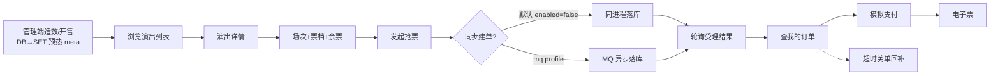

### 0.2 端到端时序（接口级）

下面按时序把 6 个主要接口串起来。阅读时抓住三点：

- **浏览**：列表打 DB；详情/场次优先打 Redis meta；场次里的余票数字仍查 DB。
- **抢票**：先做规则校验与限购，再 Lua 预扣，再 publish 建单；受理状态写在 Redis，方便客户端轮询。
- **查单**：以 MySQL 订单为准，且必须带上对应用户（`X-User-Id`），避免越权。

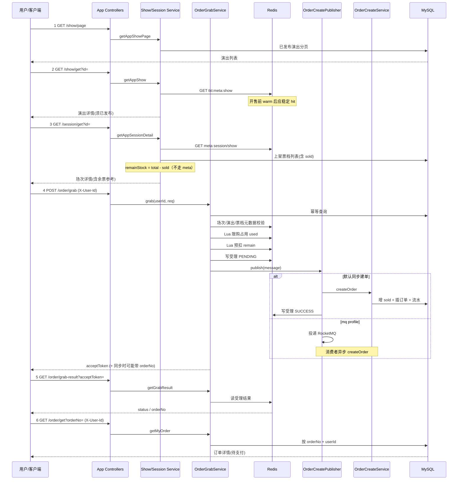

**建单模式说明：** 默认配置 `tkt.rocketmq.enabled=false`，走 `SyncOrderCreatePublisher`，`grab` 请求线程里同步落库，响应里经常已经带上 `orderNo`。开启 `mq` profile 后改为投递 RocketMQ，由消费者异步建单，此时更依赖 `grab-result` 轮询。

---

## 1. 缓存分层（先建立心智模型）

高并发抢票里，最怕两件事：**开售规则校验打爆 DB**，以及 **库存超卖**。本项目把职责拆开：

- 把「变少、变化慢」的配置型数据（是否开售、票档是否上架、价格、限购上限）放进 Redis **元数据**；
- 把「会急剧下降」的可售余量放进 Redis **库存闸门**，用 Lua 原子扣减；
- 把「这笔请求处理到哪了」放进 Redis **受理结果**，给客户端轮询；
- **MySQL 始终是权威源**：订单、`sold_stock`、流水最终都以库为准。

再换个生活化说法：

| Redis 这一层 | 像什么 | 你拿它回答什么问题 |
| --- | --- | --- |
| meta（元数据） | 公告板 / 价目表 | 「现在开不开卖？这档上架吗？一人最多几张？」 |
| remain（余票） | 号牌机 | 「号还够不够扣？够就先扣掉，别让后面的人白排队」 |
| limit used（限购占用） | 个人额度卡 | 「你名下已经占了几张？再买会不会超限购？」 |
| grab:result | 叫号屏 | 「我这笔抢票办完了没？成功单号是多少？」 |
| MySQL | 总台账本 | 「订单真正记没记上？已占用到底几张？」 |

常见误区：页面上看到「还剩 100 张」不等于你一定能抢到——那只是账本里算出来的参考数；真正抢的时候还要过号牌机（Lua）和记账（`sold_stock`）。

开售高峰下三类 Redis 职责不同，**不要混用**：

| 层 | Key（见 `TktRedisKeys`） | 存什么 | 谁写 |
| --- | --- | --- | --- |
| 元数据 | `tkt:meta:show/session/tier:{id}` | 状态、开售窗、价格、限购上限等 | 管理端 CRUD 后 `refresh*` / `warmSession`；miss 时回源 SET；TTL 默认 7 天 |
| 库存闸门 | `tkt:tier:remain:{tierId}` | 可售余量整数 | Lua `DECRBY`；失败/幂等 `INCRBY`；Key 不存在时 SETNX 懒加载 |
| 限购占用 | `tkt:limit:used:{userId}:{sessionId}:{tierId}` | 该用户有效占用张数（待支付+已支付） | Lua `INCRBY`；建单失败/关单 `DECRBY`；miss 时用 MySQL `sumActiveQuantity` SETNX |
| 受理结果 | `tkt:grab:result:{token}` | `status\|orderNo\|errorCode\|errorMsg` | Publisher / Consumer；TTL 默认 30 分钟 |

### 1.1 分层架构图

下图把「谁读谁写」画清楚：管理端改业务数据时先写 MySQL，再 SET/warm 到 meta；C 端浏览和抢票校验主要读 meta；余票展示和最终 `sold_stock` 仍以 DB 为准；抢票过闸后才会写订单和流水。

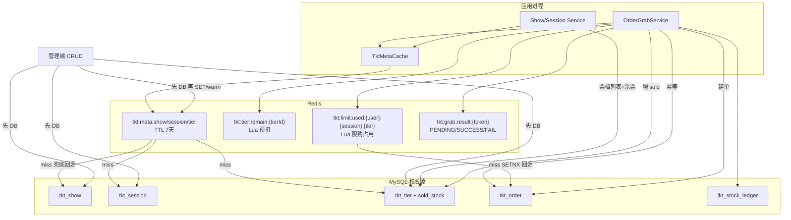

票档 meta **刻意去掉** `soldStock` / `version`（`TktMetaCache#toMetaTier`）。原因很直接：若把 `sold_stock` 塞进长 TTL 的 meta，用户看到的余票会严重滞后，还容易让人误以为「缓存里的库存」就是真相。余票展示走 DB；真正防超卖走 Lua + `increaseSoldStock`。

```java
// TktMetaCache.java — 票档进缓存前剔除库存字段
private TierDO toMetaTier(TierDO tier) {
    TierDO toCache = BeanUtils.toBean(tier, TierDO.class);
    toCache.setSoldStock(null);
    toCache.setVersion(null);
    return toCache;
}
```

### 1.2 管理端写路径（预热）

预热的目标是：**开售瞬间读元数据应稳定命中 Redis，而不是靠短 TTL 逼回源**。TTL 默认 7 天，只是防止 Key 永久堆积；日常一致性靠「写 DB 后再 SET 覆盖」，删除则 DEL。

开售前最稳妥的操作是管理端 **update 一次场次**（例如改成开售中）：`SessionServiceImpl#updateSession` 会调用 `warmSession`，一次性把该场次、所属演出、场次下全部票档 meta 刷进 Redis。

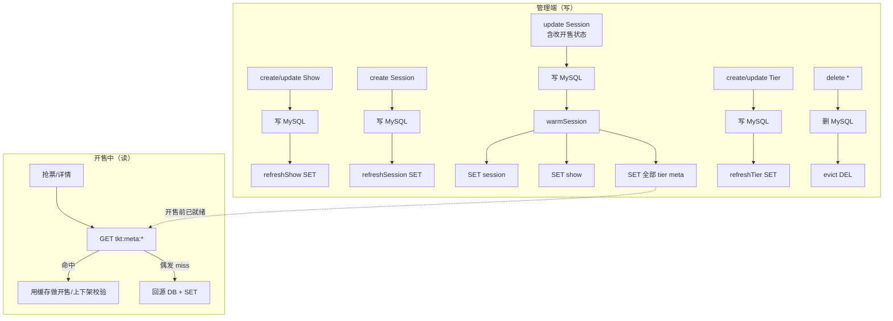

对应代码：

```java
// SessionServiceImpl#updateSession
sessionMapper.updateById(updateObj);
tktMetaCache.warmSession(reqVO.getId());  // 开售/改场次后整包预热
```

```java
// TktMetaCache#warmSession（摘要）
put(metaSession, session);
refreshShow(session.getShowId());
for (TierDO tier : tierMapper.selectListBySessionId(sessionId)) {
    put(metaTier, toMetaTier(tier));
}
```

### 1.3 元数据读路径（含 miss 兜底）

C 端详情、抢票里的 `validate*Exists`，最终都落到 `TktMetaCache#getShow/getSession/getTier`：先 GET Redis；miss 才回源 DB 并 SET。正常开售前已 warm 的话，miss 只是兜底，不应成为主路径。

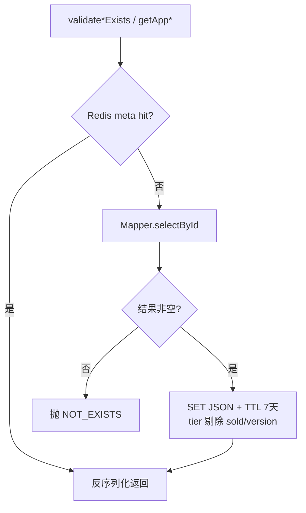

**约定小结：**

- 权威源永远是 **MySQL**；Redis meta 是配置快照，不是「先 Redis 后刷库」。
- TTL **7 天**只防 Key 永久堆积；正常靠管理端 **SET 覆盖 / delete 时 DEL**，不是靠短过期逼回源。
- 开售前务必至少 **update 一次场次**（或保证 create/update 路径已 refresh），让 `warmSession`/`refresh*` 把 meta 刷进 Redis。

---

## 2. 阶段一：浏览（只读）

浏览阶段不扣库存、不建单，目标是让用户看到「有哪些已发布演出、某场次有哪些上架票档、大概还剩多少票」。注意：页面上的余票是参考值，真正能不能抢到以抢票接口结果为准。

### 2.0 浏览流程图

用户典型路径是：列表 → 演出详情 → 场次详情（含票档）。列表为了支持分页和名称搜索，直接查已发布演出；详情与场次头信息走 meta；票档行上的 `remainStock` 必须带 `sold_stock`，所以直查 DB。

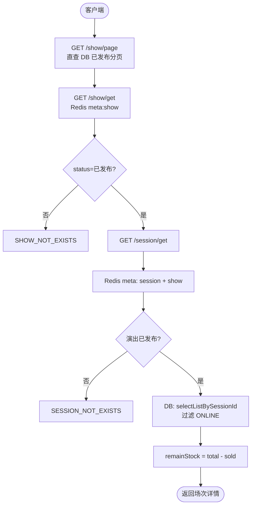

### 2.1 演出列表 —— 直查 DB

列表接口返回已发布演出分页，草稿和下架不会出现。条件查询不适合用单 Key 的 meta 缓存，因此这里直查 MySQL。

```http
GET /app-api/tkt/show/page?pageNo=1&pageSize=10
```

```java
// AppShowController
@GetMapping("/page")
public CommonResult<PageResult<AppShowPageRespVO>> getShowPage(@Valid AppShowPageReqVO reqVO) {
    return success(showService.getAppShowPage(reqVO));
}
```

`ShowServiceImpl#getAppShowPage` → `ShowMapper#selectAppPage`，**强制已发布**：

```java
// ShowMapper#selectAppPage
return selectPage(reqVO, new LambdaQueryWrapperX<ShowDO>()
        .likeIfPresent(ShowDO::getName, reqVO.getName())
        .eq(ShowDO::getStatus, ShowStatusEnum.PUBLISHED.getStatus())  // 草稿/下架不可见
        .orderByDesc(ShowDO::getSort)
        .orderByDesc(ShowDO::getId));
```

### 2.2 演出详情 —— Redis meta

点进某场演出时走 `validateShowExists` → `TktMetaCache#getShow`。即使 Redis 里有数据，若状态不是「已发布」，C 端仍按「不存在」处理，避免草稿通过直链被看到。

```http
GET /app-api/tkt/show/get?id=1
```

```java
// ShowServiceImpl#getAppShow
ShowDO show = validateShowExists(id);           // → tktMetaCache.getShow
if (!ShowStatusEnum.PUBLISHED.getStatus().equals(show.getStatus())) {
    throw exception(SHOW_NOT_EXISTS);           // 未发布当不存在
}
return BeanUtils.toBean(show, AppShowRespVO.class);
```

### 2.3 场次详情 —— meta + DB 余票

场次详情是浏览阶段信息量最大的接口：场次与所属演出从 meta 取；票档列表从 DB 取并过滤上架；`remainStock = max(total - sold, 0)`。所属演出未发布时，整场次对 C 端不可见（返回 `SESSION_NOT_EXISTS`）。

```http
GET /app-api/tkt/session/get?id=1
```

入口：`AppSessionController` → `SessionServiceImpl#getAppSessionDetail`。

```java
SessionDO session = validateSessionExists(id);              // Redis meta:session
ShowDO show = showService.validateShowExists(session.getShowId()); // Redis meta:show
if (!ShowStatusEnum.PUBLISHED.getStatus().equals(show.getStatus())) {
    throw exception(SESSION_NOT_EXISTS);                    // 演出未发布 → 场次不可见
}

// 票档列表 + 余票：必须直查 DB（含 sold_stock）
List<TierDO> tiers = tierMapper.selectListBySessionId(session.getId());
for (TierDO tier : tiers) {
    if (!TierStatusEnum.ONLINE.getStatus().equals(tier.getStatus())) {
        continue;                                           // 只返回上架
    }
    int remain = tier.getTotalStock() - tier.getSoldStock();
    tierVo.setRemainStock(Math.max(remain, 0));             // 仅供参考，可能与 Redis 有短延迟
}
```

**读到这里应记住：**

- 场次 / 演出：走 Redis meta，扛读。
- 页面余票：走 DB `sold_stock`，可能与 Redis 预扣有短延迟，产品上视为参考。
- 真正防超卖：下一阶段的 Lua + `increaseSoldStock`，不是这个展示字段。

---

## 3. 阶段二：发起抢票（核心）

抢票是全链路最关键的写路径。设计目标可以概括成三句话：

1. **无效请求尽早挡掉**（限流、未开售、下架、超限购），少打库存与建单。
2. **库存先在 Redis 过闸**，过闸后再落库，避免海量请求直接撞 MySQL。
3. **接口先受理再出结果**：返回 `acceptToken`，同步模式往往立刻带上 `orderNo`；异步模式靠轮询。

### 3.1 HTTP 入口

客户端必须带 `X-User-Id`（首期 mock 登录）和幂等键 `idempotencyKey`。同一用户对同一场次票档重复提交同一幂等键时，应返回已有订单，而不是再扣一张票。

```http
POST /app-api/tkt/order/grab
X-User-Id: 10001
Content-Type: application/json

{
  "sessionId": 1,
  "tierId": 1,
  "quantity": 1,
  "idempotencyKey": "client-10001-req-001"
}
```

```java
// AppOrderController#grab
if (userId == null) {
    throw exception(USER_ID_REQUIRED);
}
return success(orderGrabService.grab(userId, reqVO));
```

Controller 只做接入与用户校验；整段业务编排在 `OrderGrabServiceImpl#grab`，建议用 IDE 从上到下跟读一遍。

### 3.2 校验决策流（先看图再跟代码）

下图对应 `grab` 方法前半段。顺序是刻意的：限流 → 参数 → 幂等短路 → 开售/上下架（Redis meta）→ 本单限购上限（meta）→ **限购占用 + 库存预扣（Redis Lua）** → 建单。只有规则校验通过，才会进入预扣与建单。

**先用大白话过一遍「门口安检」：**

想象你冲到售票窗口，工作人员不会立刻翻库存开单，而是按固定顺序拦人：

1. **门口限流**：人太多先拦住，保护里面的系统（不是业务规则，是流量闸）。
2. **看你填的表对不对**：有没有用户 ID、张数是不是至少 1。
3. **看你是不是重复交同一张申请单**：如果这笔业务已经办过了，直接把旧订单号给你，别再扣票。
4. **看公告板**：这场开卖了吗？时间到了吗？演出发布了吗？这档票上架了吗？一人限购几张？
5. **刷个人额度卡 + 抽号**：额度够不够、号还剩多少——都在 Redis 原子扣；超限或售罄当场拒绝。
6. **以上全过**，再去总台记账出单。

为什么这个顺序？越靠前的检查越便宜、越能挡掉垃圾流量；越往后才碰「贵」的操作（写库建单）。限购累计与库存都挡在 Redis 后，开售高峰几乎不再为限购打订单表汇总。

#### 3.2.1 每一步查哪里？为什么？

抢票校验里，数据来源分三类，**不要混成「全是 Redis」或「全是 MySQL」**：

| 顺序 | 校验项 | 数据来源 | 读什么 | 为什么这样选（白话） |
| --- | --- | --- | --- | --- |
| 0 | 限流 | **进程内**（Resilience4j，非 Redis） | 令牌桶/速率许可 | 先控人流。当前是应用自己数「这一秒放过多少人」，不查 Redis/MySQL |
| 1 | `userId` / `quantity` | **本地参数** | Header + Body | 表格填错直接退回，不用查任何库 |
| 2 | 幂等是否已建单 | **MySQL** `tkt_order` | `selectByIdempotency` | 「这笔申请单办过没有」只能问账本。办过了就返回旧单，**绝不能再扣票/额度** |
| 3 | 场次存在 + 开售中 + 时间窗 | **Redis** `tkt:meta:session` | `validateSessionExists` → meta | 「开没开卖」所有人都要问，公告板扛得住 |
| 4 | 演出已发布 | **Redis** `tkt:meta:show` | `validateShowExists` | 同上，属于慢变配置 |
| 5 | 票档归属场次 + 是否上架 | **Redis** `tkt:meta:tier` | `validateTierExists` | 同上；公告板上**没有**实时余票数字，只有状态/价格/限购上限 |
| 6 | 本单数量 ≤ `perUserLimit` | **Redis meta 里的字段** | `tier.getPerUserLimit()` | 「规则写的是限购几张」跟公告走 |
| 7 | 已占用 + 本单 ≤ 限购 | **Redis** `tkt:limit:used:...`（miss 回源 MySQL） | `UserBuyLimitRedisService#tryAcquire` | 「你名下占了几张」开售时走个人额度卡；Key 没有时用订单表汇总初始化一次 |

再压缩成几句好记的：

- **问规则 → 看 Redis 公告板（meta）**
- **问「我有没有下过这单」→ 查 MySQL 账本（幂等）**
- **问「我还能不能再买几张」→ Redis 限购占用（miss 才回源 DB）**
- **问「号还够不够」→ Redis 号牌机（remain）**

限流单独说一句：它挡的是「进来的请求太多」，**不回答**「能不能买、买过没有」。实现上是 JVM 里的 Resilience4j。

**为什么限购占用用「Redis 为主 + MySQL 兜底」，而幂等仍查库？**  
限购是高频计数闸门，适合缓存；首次 miss 用 `sumActiveQuantity` 对齐账本，建单失败/超时关单时 `DECRBY` 回补。幂等问的是「有没有那张订单」，必须以库为准，不能只信计数器。

校验通过后的闸门顺序：**先限购 tryAcquire，再库存 deduct**；库存失败会回补限购，避免额度被白占。

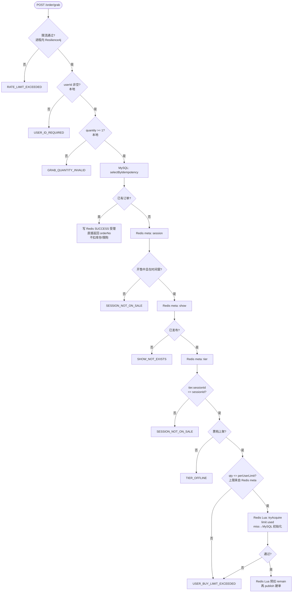

### 3.3 跟读 `grab`：一步对应一段代码

下面按代码顺序拆开。每一段都可以对照上面的「安检」比喻：先挡人、再看表、再查有没有办过、再看公告、再算限购，最后才抽号办票。

#### Step 0 — 限流（P5）

抢票入口最先做全局限流，避免压测或黄牛流量直接打穿后面的 Redis/DB。超限抛 `RATE_LIMIT_EXCEEDED`。  
白话：门太窄，先限制同时进来多少人；被拦下来不代表「没票」，只是「这会儿太挤，稍后再试」。配置与指标见 P5 讲解文档。

```java
grabRateLimitService.checkPermit();  // Resilience4j；超限 RATE_LIMIT_EXCEEDED
```

#### Step 1 — 参数与幂等（MySQL）

数量非法直接拒绝。幂等命中说明这笔客户端请求已经建过单：写一条 SUCCESS 受理结果并返回已有 `orderNo`，**不再扣 Redis、不再插单**。

白话：用户网络卡了连点两次「抢票」，如果两次带同一个 `idempotencyKey`，第二次应拿到同一张订单，而不是扣两张票。所以这里必须查订单表，不能猜。  
注意：幂等命中时用 `orderNo` 当作受理 token（与首次抢票生成的 UUID token 不同），客户端应以返回的 `orderNo` 去查单。

```java
if (reqVO.getQuantity() == null || reqVO.getQuantity() < 1) {
    throw exception(GRAB_QUANTITY_INVALID);
}

OrderDO exists = orderMapper.selectByIdempotency(
        userId, reqVO.getSessionId(), reqVO.getTierId(), reqVO.getIdempotencyKey());
if (exists != null) {
    // 已建单：写 SUCCESS 受理，直接返回，不扣 Redis
    grabResultService.saveSuccess(exists.getOrderNo(), exists.getOrderNo());
    return buildResp(exists.getOrderNo(), exists.getOrderNo());
}
```

#### Step 2 — 开售 / 上下架校验（Redis meta）

这些规则几乎全靠 meta，避免开售瞬间每笔请求都 `selectById`。校验内容包括：场次存在且处于开售状态、当前时间在开售窗内、演出已发布、票档属于该场次且上架。

白话：这几问都是「政策/公告」类问题——开没开卖、上没上架——几乎所有请求都要问，而且答案短期内不变。所以提前贴在 Redis 公告板上；若每人都去 MySQL 翻档案，数据库会先被问挂。

```java
SessionDO session = sessionService.validateSessionExists(reqVO.getSessionId());
validateSessionOnSale(session);  // status=开售中 + 在 saleStart~saleEnd 窗内

if (!ShowStatusEnum.PUBLISHED.getStatus().equals(
        showService.validateShowExists(session.getShowId()).getStatus())) {
    throw exception(SHOW_NOT_EXISTS);
}

TierDO tier = tierService.validateTierExists(reqVO.getTierId());
if (!tier.getSessionId().equals(session.getId())) {
    throw exception(SESSION_NOT_ON_SALE);   // 票档不属于该场次
}
if (!TierStatusEnum.ONLINE.getStatus().equals(tier.getStatus())) {
    throw exception(TIER_OFFLINE);
}
```

`validateSessionOnSale`：

```java
if (!SessionStatusEnum.ON_SALE.getStatus().equals(session.getStatus())) { ... }
if (saleStartTime != null && now.isBefore(saleStartTime)) { ... }
if (saleEndTime != null && now.isAfter(saleEndTime)) { ... }
```

#### Step 3 — 限购（本单上限 + Redis 占用计数）

先看本单张数是否超过票档 `perUserLimit`（来自 meta），再调用 `UserBuyLimitRedisService#tryAcquire`：用 Lua 判断 `used + qty <= limit` 并 `INCRBY`。

白话拆成两问：

1. 「规则上一人最多买几张？」——答案在 meta 的 `perUserLimit`（公告板）。
2. 「你名下已经占了几张（含还没付款的）？」——答案在 Redis `tkt:limit:used:{userId}:{sessionId}:{tierId}`；Key 不存在时用 MySQL `sumActiveQuantity` SETNX 初始化（兜底对齐账本）。

待支付也算占用，不然可以一直占着不付款绕过限购。支付成功**不减**占用；超时关单成功才 `DECRBY` 释放。

```java
if (reqVO.getQuantity() > tier.getPerUserLimit()) {
    throw exception(USER_BUY_LIMIT_EXCEEDED);
}
// 见 Step 4：tryAcquire 与库存 deduct 一起做
```

#### Step 4 — 限购占用 + Lua 预扣 + 写 PENDING + publish

通过规则校验后生成 `acceptToken`，然后严格按 **限购 tryAcquire → 库存 deduct → PENDING → publish**：

```java
userBuyLimitRedisService.tryAcquire(
        userId, session.getId(), tier.getId(), qty, tier.getPerUserLimit());
try {
    tierStockRedisService.deduct(tier.getId(), qty);
} catch (RuntimeException ex) {
    userBuyLimitRedisService.rollback(userId, session.getId(), tier.getId(), qty);
    throw ex;
}
grabResultService.savePending(acceptToken);
orderCreatePublisher.publish(message);
```

白话：先刷额度卡，再抽号；号抽失败要把额度加回去。  
建单失败 / 幂等回补时，Publisher 会同时回补 **remain + limit used**；超时关单成功同样两者都回补。

默认同步建单时，`publish` 返回后受理结果通常已是 SUCCESS，`grab` 会再读一次结果，把 `orderNo` 填进响应。

### 3.4 成功抢票写入顺序

成功路径上，数据写入顺序如下。若建单失败，Publisher 会回补 **remain + limit used**，并把受理结果写成 FAIL，保证「Redis 占用成功但建单失败」不会永久吞库存/额度。

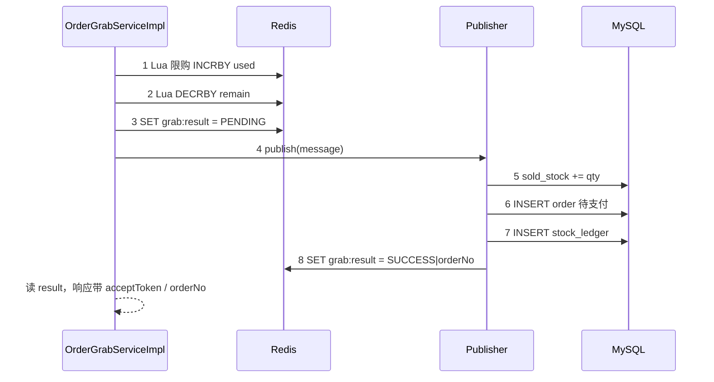

---

## 4. Redis Lua 预扣（跟 `TierStockRedisServiceImpl`）

预扣层的职责是：**用尽量低的延迟，判断「现在还能不能卖这么多张」**。它不是最终账本——最终占用以 MySQL `sold_stock` 为准——但它挡住了绝大部分无效建单请求。

白话：号牌机上显示还剩多少号。你来一张就减一号；号不够直接说售罄，不用再去柜台折腾。  
柜台（MySQL）记账时还会再核对一次「已卖张数有没有超过总库存」，防止号牌机和账本偶尔对不齐时超卖。  
如果柜台发现办不了（售罄、冲突等），要把号牌加回去（`rollback`），不然号就被「吞」了。

Key：`tkt:tier:remain:{tierId}`，值为可售整数。

### 4.0 预扣流程图

首次扣减某票档时，若 Redis 还没有 Key，会从 DB 算 `total - sold` 并用 SETNX 写入（并发初始化时只有一人成功即可）。随后执行 Lua：余量不足返回 0；Key 异常返回 -1；成功则 DECRBY。

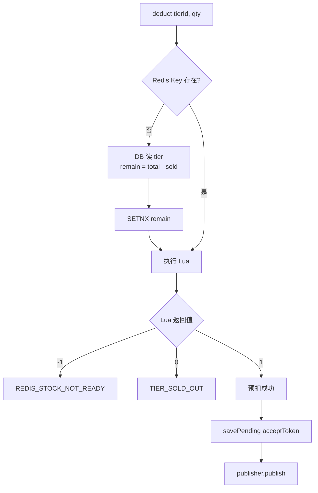

### 4.1 懒加载初始化

```java
public void ensureRemainInitialized(Long tierId) {
    if (Boolean.TRUE.equals(stringRedisTemplate.hasKey(key))) {
        return;
    }
    TierDO tier = tierMapper.selectById(tierId);
    int remain = Math.max(tier.getTotalStock() - tier.getSoldStock(), 0);
    stringRedisTemplate.opsForValue().setIfAbsent(key, String.valueOf(remain)); // SETNX
}
```

### 4.2 Lua：原子判断 + DECRBY

必须用 Lua（或等价原子脚本），否则「读余量 → 判断 → 扣减」三步在并发下会超卖。脚本在 Redis 单线程内一次完成。

```lua
local remain = redis.call('GET', KEYS[1])
if remain == false then return -1 end
remain = tonumber(remain)
local qty = tonumber(ARGV[1])
if remain < qty then return 0 end
redis.call('DECRBY', KEYS[1], qty)
return 1
```

| 返回值 | 含义 | Java 处理 |
| --- | --- | --- |
| `-1` | Key 仍不存在 | `REDIS_STOCK_NOT_READY` |
| `0` | 余量不足 | `TIER_SOLD_OUT` |
| `1` | 预扣成功 | 继续 |

```java
public void deduct(Long tierId, int quantity) {
    ensureRemainInitialized(tierId);
    Long result = stringRedisTemplate.execute(DEDUCT_SCRIPT, keys, String.valueOf(quantity));
    if (result == null || result == -1L) throw exception(REDIS_STOCK_NOT_READY);
    if (result == 0L) throw exception(TIER_SOLD_OUT);
}
```

回补：`rollback` = `INCRBY`。调用场景包括：建单业务失败、幂等命中导致本次不应占库存、MQ 发送失败等。由 Publisher / Consumer 负责调用；限购占用 `UserBuyLimitRedisService#rollback` 与库存回补成对出现。

### 4.3 限购占用（跟 `UserBuyLimitRedisServiceImpl`）

与库存闸门对称，专门挡「这个人买太多」：

| 项 | 内容 |
| --- | --- |
| Key | `tkt:limit:used:{userId}:{sessionId}:{tierId}` |
| 初始化 | miss 时 `sumActiveQuantity` + SETNX（MySQL 兜底） |
| 抢票 | Lua：`used + qty > limit` → 失败；否则 `INCRBY` |
| 回补 | 建单失败 / 幂等回补 / **超时关单** → `DECRBY` |
| 支付成功 | **不动**（仍占用） |

---

## 5. 阶段三：建单落库

预扣成功只代表「Redis 认为还能卖」。真正占用库存、生成待支付订单，发生在 `OrderCreateService#createOrder`。这一步用事务保证：增 `sold_stock`、插订单、写流水要么一起成功，要么回滚；若判定「其实不该再占库存」，通过 `rollbackRedis=true` 让调用方把 Redis 余量加回去。

白话：抽到号不等于票已经是你的。还要在总台：

1. 账本上「已占用」加几张（`sold_stock += qty`）；
2. 写下待支付订单（给你订单号、付款截止时间）；
3. 记一笔流水备查。

这三步绑在同一事务里：成功就都成功；中途发现其实不该再占（例如幂等发现已有单），不但事务回滚，还要把 Redis 号牌加回去。

### 5.1 Publisher 分支

`OrderCreatePublisher` 有两个实现，由配置二选一加载，业务侧只依赖接口：

| 实现 | 条件 | 行为 |
| --- | --- | --- |
| `SyncOrderCreatePublisher` | `tkt.rocketmq.enabled=false`（默认） | 同进程 `createOrder`，立刻写 SUCCESS/FAIL |
| `MqOrderCreatePublisher` | `enabled=true` | 投递 `TKT_ORDER_CREATE`；发送失败立刻回补 + FAIL |

白话：默认是「窗口当场办完」——你站着等，办完屏幕直接变成功并给出单号，方便本地联调。  
打开 MQ 则是「先收件、后台办」——适合削峰演示；这时客户端更要盯叫号屏（轮询）。

### 5.1.1 同步 vs MQ

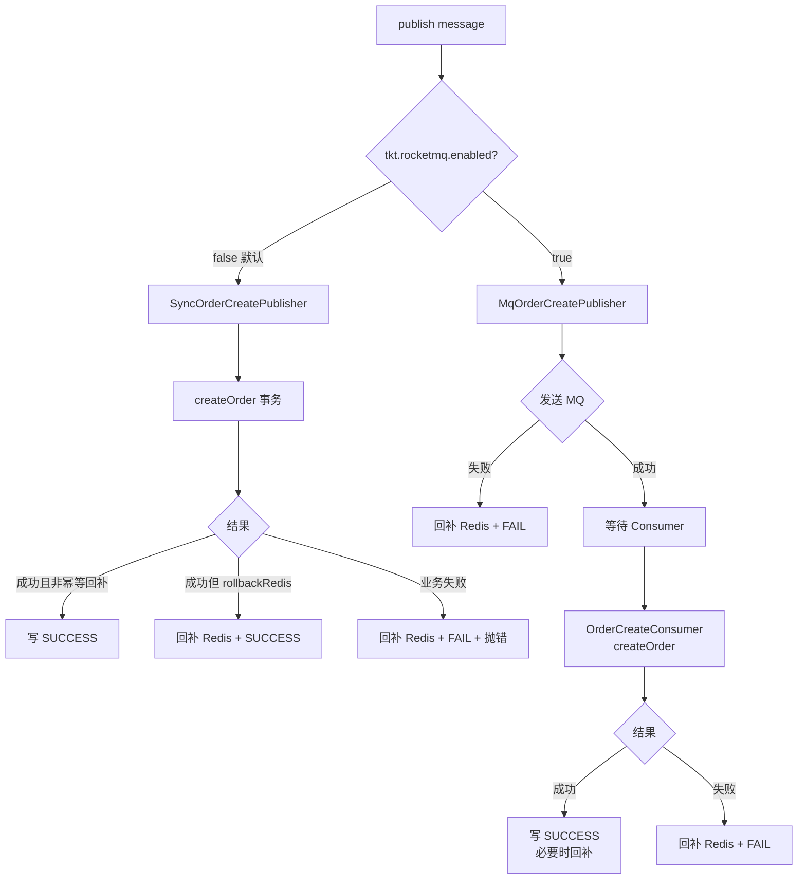

默认同步路径（本地联调必看）：成功写 SUCCESS；若结果要求回补 Redis（幂等命中等）则先 INCR 再 SUCCESS；业务异常则回补 + FAIL + 继续抛出，让 `grab` 接口把错误返回给客户端。

```java
// SyncOrderCreatePublisher#publish
try {
    CreateOrderResult result = orderCreateService.createOrder(message);
    if (result.isRollbackRedis()) {
        tierStockRedisService.rollback(message.getTierId(), message.getQuantity());
    }
    grabResultService.saveSuccess(message.getMessageId(), result.getOrderNo());
} catch (ServiceException ex) {
    tierStockRedisService.rollback(...);
    grabResultService.saveFail(message.getMessageId(), ex.getCode(), ex.getMessage());
    throw ex;
}
```

MQ 路径在「消息都发不出去」时同样必须回补，否则 Redis 已扣、库里又没有订单：

```java
// MqOrderCreatePublisher#publish
try {
    rocketMQTemplate.syncSend(TOPIC_ORDER_CREATE, ...);
} catch (RuntimeException ex) {
    tierStockRedisService.rollback(...);
    grabResultService.saveFail(..., 500, "消息投递失败");
    throw ex;
}
```

### 5.2 事务建单 `OrderCreateServiceImpl#doCreateOrder`

建单内部再次查幂等，是为了防止并发双请求都通过了 `grab` 前半段。随后用条件更新增加 `sold_stock`（`sold + qty <= total`），影响行数为 0 视为售罄。订单插入若撞唯一键，事务标记回滚并返回已有单，同时要求回补 Redis。

### 5.2.1 建单与库存对齐流程图

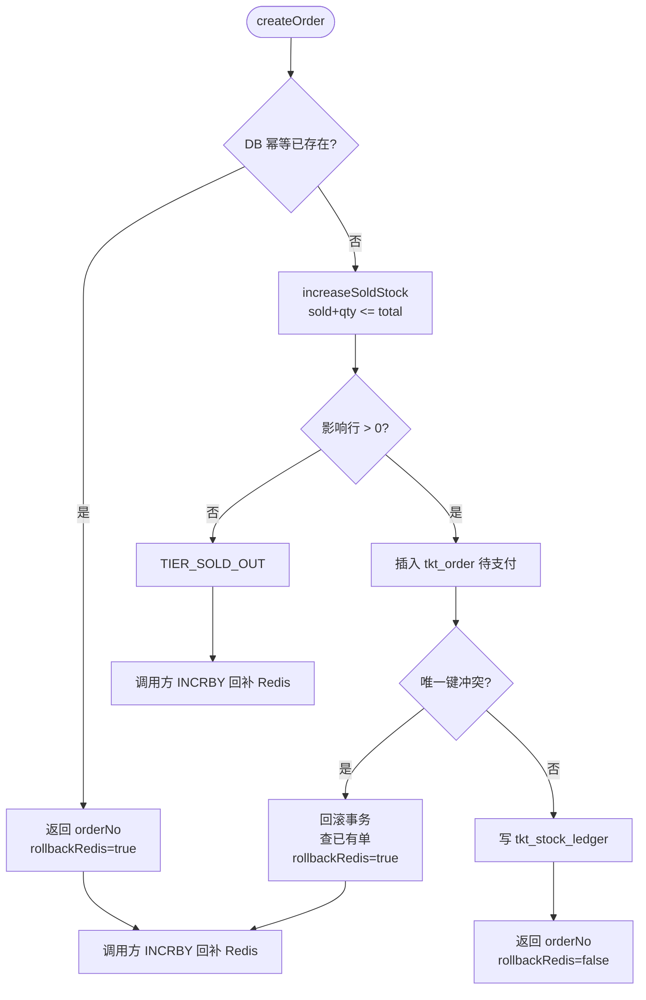

```java
@Transactional(rollbackFor = Exception.class)
public CreateOrderResult createOrder(OrderCreateMessage message) { ... }

private CreateOrderResult doCreateOrder(OrderCreateMessage message) {
    // 1) 再查幂等：已有单 → rollbackRedis=true（调用方 INCR Redis）
    OrderDO exists = orderMapper.selectByIdempotency(...);
    if (exists != null) {
        return new CreateOrderResult(exists.getOrderNo(), true);
    }

    // 2) 条件增 sold（防超卖的 DB 闸门）
    int rows = tierMapper.increaseSoldStock(tier.getId(), message.getQuantity());
    if (rows == 0) {
        throw exception(TIER_SOLD_OUT);  // Publisher 会回补 Redis
    }

    // 3) 插待支付订单；唯一键冲突 → 标记回滚事务，返回已有单 + rollbackRedis
    OrderDO order = buildOrder(message);  // payDeadline = now + 配置分钟
    if (!insertOrder(order, message)) {
        TransactionAspectSupport.currentTransactionStatus().setRollbackOnly();
        return new CreateOrderResult(duplicated.getOrderNo(), true);
    }

    // 4) 写流水 change_type = ORDER_RESERVE
    insertLedger(...);
    return new CreateOrderResult(order.getOrderNo(), false);
}
```

DB 条件更新是权威防超卖（即使 Redis 因异常多扣/少扣，库侧也不会让 `sold` 超过 `total`）：

```java
// TierMapper
@Update("UPDATE tkt_tier SET sold_stock = sold_stock + #{qty}, version = version + 1, ..."
      + "WHERE id = #{id} AND deleted = 0 AND sold_stock + #{qty} <= total_stock")
int increaseSoldStock(@Param("id") Long id, @Param("qty") int qty);
```

**库存口径对齐：**

| 层 | 含义 |
| --- | --- |
| Redis `remain` | 可售张数（闸门） |
| MySQL `sold_stock` | 已占用 = 待支付 + 已支付 |
| 关系 | 成功路径上 `remain ≈ total - sold`；失败必须 `rollback` Redis |

订单创建后状态为待支付，并带上 `payDeadline`（默认配置分钟数）。超时未支付由关单 Job 减 `sold` 并回补 Redis，见 P3/P4 文档。

---

## 6. 阶段四：轮询与查单

抢票接口采用「先受理、后出结果」的协议，是为了同时兼容同步建单与 MQ 异步建单。客户端应优先看响应里的 `orderNo`；没有再按 `pollSeconds` 轮询 `grab-result`。

白话：你交完申请会拿到一张「叫号条」（`acceptToken`）。  
- 窗口当场办完时，回执上往往已经写好订单号，你可以直接去查单。  
- 后台慢慢办时，回执上可能还没有单号，你就盯着叫号屏（`grab-result`）：办理中 / 成功出单号 / 失败看原因。  
真正「我的订单详情」永远以 MySQL 为准，叫号屏只告诉你办完没有。

### 6.1 受理结果协议

存储：`tkt:grab:result:{token}`，字符串协议为 `status|orderNo|errorCode|errorMsg`（见 `GrabResultServiceImpl`）。TTL 默认 30 分钟，过期后轮询会得到 `GRAB_RESULT_NOT_EXISTS`。

| status | 含义 | 客户端建议 |
| --- | --- | --- |
| 0 | PENDING（处理中） | 等待后继续轮询 |
| 1 | SUCCESS | 用 `orderNo` 查订单详情 |
| 2 | FAIL | 展示 `errorCode` / `errorMsg`，不要当成功 |

```http
GET /app-api/tkt/order/grab-result?acceptToken={acceptToken}
```

### 6.2 客户端轮询流

默认同步建单时，`grab` 响应里往往已有 `orderNo`，可直接查单。MQ 异步或响应未带 `orderNo` 时，用返回的 `pollSeconds`（配置 `tkt.grab.async-poll-seconds`，默认 1）间隔轮询。

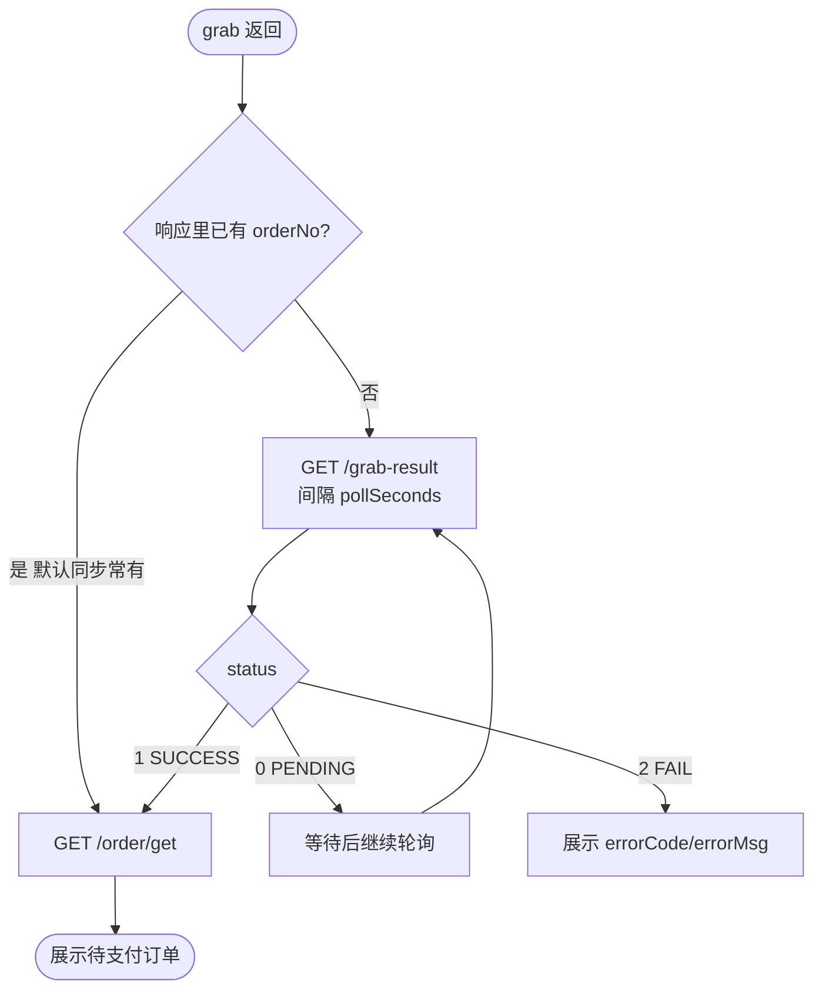

### 6.3 查我的订单（防越权）

查单以 MySQL 为准。必须校验 `order.userId` 与 Header 用户一致；不一致时与「订单不存在」返回同一错误码，避免通过错误信息探测他人订单号。

```http
GET /app-api/tkt/order/get?orderNo=...
X-User-Id: 10001
```

```java
// OrderGrabServiceImpl#getMyOrder
OrderDO order = orderMapper.selectByOrderNo(orderNo);
if (order == null || !userId.equals(order.getUserId())) {
    throw exception(ORDER_NOT_EXISTS);  // 不存在与越权同一错误码
}
```

查到待支付订单后，可继续模拟支付或等待超时关单，见 P3/P4。

---

## 7. 关键数据流一览

把前面各阶段落到「写什么、读什么」上，便于排错时判断该查 Redis 还是 MySQL。

| 存储 | Key / 表 | 谁写 | 谁读 |
| --- | --- | --- | --- |
| Redis | `tkt:meta:show/session/tier` | 管理端 SET/warm；delete DEL；miss 回源 | `validate*Exists`、场次详情 |
| Redis | `tkt:tier:remain:{tierId}` | Lua DECR / rollback INCR / SETNX | 预扣 |
| Redis | `tkt:limit:used:{user}:{session}:{tier}` | Lua INCR / 失败与关单 DECR / miss SETNX | 限购 |
| Redis | `tkt:grab:result:{token}` | Publisher / Consumer | 轮询 |
| MySQL | `tkt_order` | `OrderCreateServiceImpl` | 幂等、限购 miss 初始化、查单 |
| MySQL | `tkt_tier.sold_stock` | `increaseSoldStock` / 关单 decrease | 场次余票、对账 |
| MySQL | `tkt_stock_ledger` | 建单 / 支付 / 关单 / 对账 | 审计 |

### 7.1 读写关系简图

左边偏「写路径」（预热、预扣、建单），右边偏「读路径」（浏览、校验、轮询、查单）。排错时可按现象选边：例如「校验说未开售」先看 meta 是否预热；「显示有票但抢失败」对比 DB `sold` 与 Redis `remain`；「轮询一直 PENDING」看 Publisher/Consumer 是否写了 SUCCESS/FAIL。

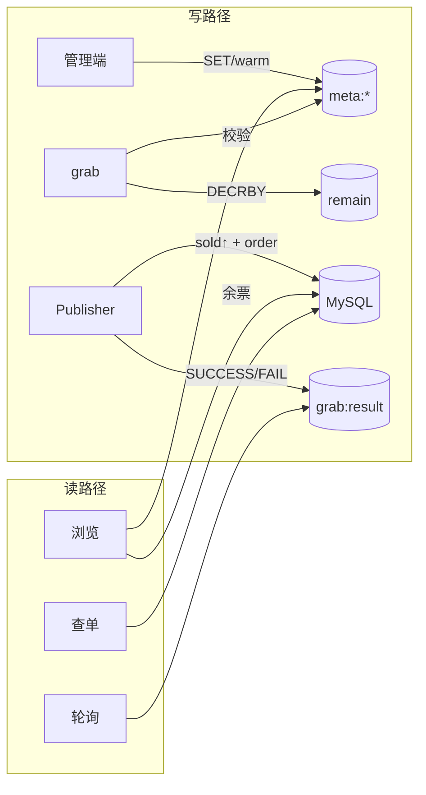

---

## 8. 客户端推荐调用串

下面是一份可直接拷贝联调的请求顺序。注意：抢票与查单都需要 `X-User-Id`；`idempotencyKey` 在客户端应保证「同一次用户操作唯一」，重试时复用同一 key。

```http
### 1. 列表
GET /app-api/tkt/show/page?pageNo=1&pageSize=10

### 2. 详情
GET /app-api/tkt/show/get?id=1

### 3. 场次+票档
GET /app-api/tkt/session/get?id=1

### 4. 抢票
POST /app-api/tkt/order/grab
X-User-Id: 10001
Content-Type: application/json

{
  "sessionId": 1,
  "tierId": 1,
  "quantity": 1,
  "idempotencyKey": "client-10001-req-001"
}

### 5. 轮询（无 orderNo 时）
GET /app-api/tkt/order/grab-result?acceptToken={acceptToken}

### 6. 查单
GET /app-api/tkt/order/get?orderNo={orderNo}
X-User-Id: 10001

### 7. 模拟支付（见 P3/P4 文档）
POST /app-api/tkt/order/{orderNo}/pay
X-User-Id: 10001
```

---

## 9. 与后续能力的衔接

浏览 + 抢票主链路之后，订单进入待支付。支付成功生成电子票且不改 `sold_stock` / 限购占用（建单时已占用）；超时关单则减 `sold`、回补 Redis remain **与** limit used。限流、trace、指标与 k6 压测见 P5。

| 能力 | 用户感知 | 代码 / 文档 |
| --- | --- | --- |
| 模拟支付 + 电子票 | 待支付 → 已支付 | P3：`OrderPayService` / `TicketService` |
| 超时关单 + 对账 | 超时关单、余票与限购名额回升 | P4：`OrderCloseJob` / `StockReconcileJob` |
| 限流 / 观测 / k6 | 开售峰值可控、可观测 | P5：`GrabRateLimitService`、`TktMetrics`、`scripts/k6/grab.js` |
| 限购 Redis 计数 | 开售时限购少打库 | 已做：`UserBuyLimitRedisService`（miss 回源 MySQL） |

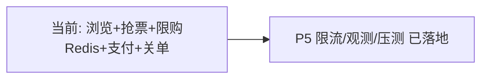

---

## 10. 对比：本项目全链路 vs 生产级抢票 vs 黑马点评

本节把「教学/演示样例」放进两个坐标系里看：一是和**真实投入生产的大麦类抢票**比缺什么；二是和常见的 **Redis 实战课「黑马点评」**（优惠券秒杀那条线）比，各自强在哪、弱在哪。方便写简历时诚实定位，也方便面试时主动讲边界。

### 10.1 和真正生产级抢票链路比，缺陷在哪

这套全链路作为**可演示样例**，骨架是对的：规则缓存 → Redis 预扣 →（可）MQ → MySQL 权威落库 → 支付/关单 → 对账。但和线上大流量票务比，差距主要在下面几类。

#### （1）业务能力（产品层）

| 生产常见 | 本项目现状 |
| --- | --- |
| 选座 / 分区库存 / 连座 | 仅票档级库存，无座 |
| 真实支付、分账、退款、发票 | 模拟支付；退款状态基本未用 |
| 实名、风控、黄牛识别、验证码/排队室 | Header `X-User-Id` mock；几乎无风控 |
| 候补、转赠、核销入场等履约 | 电子票较简，无完整履约 |

这些多半是**首期刻意砍掉的边界**（见 `MEMORY.md`），不是实现疏漏，但答辩时要说清「简化版」。

#### （2）流量入口与治理

- **无真正 API 网关**：生产有鉴权、WAF、按 IP/用户/接口分层限流与熔断；这里是应用内 Resilience4j **全局限流**（演示用，多实例不共享配额）。
- **无排队层 / 等待室**：大流量常先虚拟排队再放行；本项目请求直接打到业务进程。
- **边缘能力弱**：CDN/动静分离、活动级隔离开关等基本没有。

白话：生产先在门口修闸和排队，再进售票厅；这里人基本直接挤到窗口。

#### （3）库存与热点（工程上最大的差距）

- **限购累计**：已改为 Redis 为主（`tkt:limit:used`），miss 回源 MySQL；生产还可再加强制预热与对账纠偏限购 Key。
- **幂等查库正确但偏重**：生产常加 Redis 幂等短路减轻 DB。
- **单票档热点**：一个 `tierId` 的 `remain` / `sold_stock` 是典型热点；生产会拆库存片、分段库存等。
- **一致性闭环偏「最小可用」**：有回补 + 对账 Job，但缺完整的死信运营、半成功治理、人工介入与告警闭环；限购 Key 暂无独立对账。
- **remain / limit 懒加载**：能跑；生产更强调**开售前强制预热**，避免开售瞬间打 DB 初始化。

#### （4）MQ、数据扩展、安全与资金

| 维度 | 生产常见 | 本项目 |
| --- | --- | --- |
| 建单 | 峰值几乎必异步削峰 | 默认同步建单，MQ 要开 profile |
| MQ 可靠性 | 事务消息/Outbox、死信、堆积监控 | 骨架级投递与消费 |
| 数据层 | 分库分表、读写分离、多活 | 单库单表演示形态（扩展在文档/P6） |
| 账号安全 | OAuth、防刷签名、设备指纹 | mock 登录；管理端简单 Token |
| 支付 | 回调、渠道对账、差错处理 | 模拟支付，过不了资金审计 |
| 运维 | SLI/SLO、混沌、自动扩缩、灰度开关 | trace/指标/k6 雏形，无完整运维体系 |

#### （5）一句话定位（对生产）

| | |
| --- | --- |
| **已经像生产的** | 分层抗压思路：规则缓存 → Redis 预扣 →（可）MQ → MySQL + 流水对账 |
| **明显不像生产的** | 入口治理、风控实名、MQ 可靠投递、分库分表/多活、真实支付、选座履约 |
| **面试怎么说** | 「主链路形态对齐生产；限购已 Redis 闸门 + DB 兜底；已知短板是进程内限流、默认同步建单、无网关排队与真实支付」 |

只记三条仍在的差距：**① 缺网关级排队与分布式限流；② MQ 默认未开、可靠投递偏骨架；③ 资金、风控、扩展性未按生产闭环。**

---

### 10.2 和「黑马点评」比，强在哪、弱在哪

「黑马点评」通常指黑马程序员那套 **探店 + Redis 实战** 项目：附近商户（GEO）、关注推送（Feed）、签到（BitMap）、UV（HyperLogLog）、以及 **优惠券秒杀**（Redis 扣库存 + 一人一单 + 常配合阻塞队列/异步下单）等。它和本项目都是「用 Redis 扛突发写」的教学项目，但**业务域与闭环深度不同**。

#### （1）场景定位对照

| 维度 | 黑马点评（常见课设） | 本项目（抢票票务） |
| --- | --- | --- |
| 业务域 | 探店/点评 + **优惠券秒杀** | **大麦类票务**：演出/场次/票档开售抢票 |
| 核心矛盾 | 秒杀券超卖、一人一单；顺带学 Redis 多数据结构 | 开售峰值 + **占位/支付/超时释放** 交易闭环 |
| 库存对象 | 优惠券库存（偏「领一张」） | 票档库存（可多张、有限购、有占用语义） |
| 订单语义 | 秒杀下单相对轻；支付/关单往往简化 | 待支付占用 `sold_stock` → 支付出票 / 超时关单回补 |
| Redis 广度 | **更广**：缓存、锁、GEO、Feed、BitMap、HyperLogLog、Stream 等 | **更聚焦交易链路**：meta 预热、Lua 预扣、受理结果、Job 锁 |
| 工程形态 | 多为单体 + Redis 技能点串联 | 多模块 + 管理端 CRUD + C 端全链路 + Job/对账/观测 |

#### （2）秒杀/抢购主链路对照

| 能力点 | 黑马点评常见做法 | 本项目做法 | 谁更接近「票务生产叙事」 |
| --- | --- | --- | --- |
| 预扣 | Redis 扣券库存（常 Lua / 命令组合） | Redis Lua `remain` DECRBY | 相近（都是先 Redis 闸门） |
| 一人一单 / 限购 | 常在 **Redis** 里做「是否已下单」判断，挡得更靠前 | **Redis** `limit used` 按张数占用 + miss 回源 MySQL；关单释放 | 两边都挡在 Redis；本项目多了「张数占用 + 关单回补」票务语义 |
| 异步建单 | 常见：阻塞队列 / 异步线程池把下单拖出请求线程 | `OrderCreatePublisher`：默认同步，可开 RocketMQ | 本项目有标准 MQ 抽象，但默认未开；黑马异步教学感更强 |
| 受理与轮询 | 多为同步返回或简单异步 | `acceptToken` + `grab:result` 轮询协议 | 本项目更像「先受理后出结果」的网关/中台形态 |
| 元数据 | 商户/券信息缓存常见，预热叙事一般 | 管理端写后 **SET/warmSession**，开售读稳定命中 | 本项目对「开售前预热」讲得更完整 |
| 占位与释放 | 课设里超时关单/占位释放常弱或没有 | 明确占用语义 + 超时关单回补 Redis + 对账 Job | **本项目明显更完整** |
| 支付履约 | 多为简化或占位 | 模拟支付 + 电子票（仍非真实渠道） | 本项目多走了半步交易闭环 |
| 审计 | 较少强调库存流水 | `tkt_stock_ledger` + 对账修正 | 本项目更偏交易系统 |
| 限流观测 | 课设一般点到为止 | Resilience4j + Micrometer + k6 | 本项目演示治理更完整 |
| Redis「花活」 | GEO/Feed/签到等是加分点 | 基本没有社交/LBS 能力 | **黑马点评覆盖面更广** |

#### （3）通俗对照（方便记忆）

- **黑马点评**：像「学 Redis 武功秘籍」——数据结构多、秒杀券一条线经典，但**不是完整票务账本**。
- **本项目**：像「学一场演唱会怎么开售」——公告板预热、额度卡限购、号牌机预扣、总台记账、超时放票、对账纠偏；**交易状态机更像真票务**。Redis 玩法广度（GEO/Feed 等）、异步默认开启等方面仍不如课设覆盖面宽。

#### （4）谁更强？取决于你比什么

| 你想证明的能力 | 更有说服力的一方 |
| --- | --- |
| Redis 多数据结构与周边场景（附近的店、关注流、签到） | 黑马点评 |
| 「一人一单」极简秒杀课设叙事 | 黑马点评（常见实现） |
| 按张数限购 + 占用/关单回补 | **本项目** |
| 票务占用语义、超时关单、库存流水与对账 | **本项目** |
| 管理端造数 + 开售预热 + C 端浏览/抢票/支付一条链 | **本项目** |
| MQ 抽象、受理令牌轮询、限流与压测观测 | **本项目**（相对课设） |
| 接近大麦生产的完整度（网关排队、风控、真实支付、分库多活） | **双方都不够**，本项目文档规划更多，代码仍是演示深度 |

#### （5）面试时怎么一句话对比黑马点评

> 黑马点评强在 **Redis 技能面** 和优惠券秒杀教学路径；本项目强在 **票务交易闭环**（预热、限购占用、预扣、占位、支付/关单、对账）和工程上的管理端/观测/MQ 抽象。两者都不是生产票务，但本项目的领域模型和库存口径更接近大麦类场景；限购已与黑马一样挡在 Redis，并按张数 + 关单释放做了票务化。

---

### 10.3 三方速查表（生产 / 本项目 / 黑马点评）

| 能力 | 生产级票务 | 本项目 | 黑马点评（秒杀线） |
| --- | --- | --- | --- |
| Redis 预扣防超卖 | ✅ | ✅ | ✅ |
| 开售元数据预热 | ✅ | ✅（warmSession） | △（有缓存，预热叙事较弱） |
| 待支付占用 + 超时释放 | ✅ | ✅ | △/❌（常简化） |
| 库存流水 / 对账 | ✅ | ✅（最小版） | ❌/弱 |
| 限购挡在 Redis | ✅ 常见 | ✅（张数占用 + miss 回源 DB） | ✅ 常见（一人一单） |
| MQ 削峰建单 | ✅ | △（有实现，默认关） | △（常阻塞队列/异步） |
| 网关 / 排队室 / 风控 | ✅ | ❌ | ❌ |
| 真实支付清结算 | ✅ | ❌（模拟） | ❌/弱 |
| 选座 / 分区库存 | 常见 | ❌ | ❌ |
| 分库分表 / 多活 | ✅ | 文档/规划为主 | ❌ |
| Redis 广度（GEO/Feed 等） | 视业务 | ❌ | ✅ |
| 限流 + 指标 + 压测脚本 | ✅ | ✅（演示级） | △ |

---

## 11. 修订记录

| 版本 | 日期 | 说明 |
| --- | --- | --- |
| v1.0 | 2026-07-23 | 首版：结合 P1/P2 代码描述浏览+抢票全链路 |
| v1.1～v1.5 | 2026-07-23 | 元数据 Caffeine→Redis、预热/TTL、多张流程图 |
| v1.6～v1.7 | 2026-07-29 | 文首总结；衔接 P3/P4 |
| v1.8 | 2026-08-04 | 改为「跟代码走」：关键路径贴源码、减少空讲流程图；对齐 P5 已落地 |
| v1.9 | 2026-08-04 | 在跟代码走基础上补回多阶段流程图 |
| v1.10 | 2026-08-04 | 各章节补齐文字说明：阶段意图、设计原因、失败回补与排错提示 |
| v1.11 | 2026-08-04 | 3.2 明确校验项的 Redis / MySQL / 本地来源对照表与选型原因 |
| v1.12 | 2026-08-04 | 文首与缓存/校验/预扣/建单/轮询补充通俗类比（公告板、号牌机、叫号屏、账本） |
| v1.13 | 2026-08-04 | 文末增加与生产级抢票、与黑马点评的对比及三方速查表 |
| v1.14 | 2026-08-04 | 限购改为 Redis 为主 + MySQL miss 兜底；同步全文校验/回补/对比表述 |
