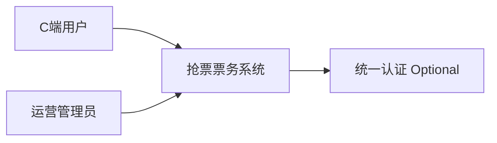
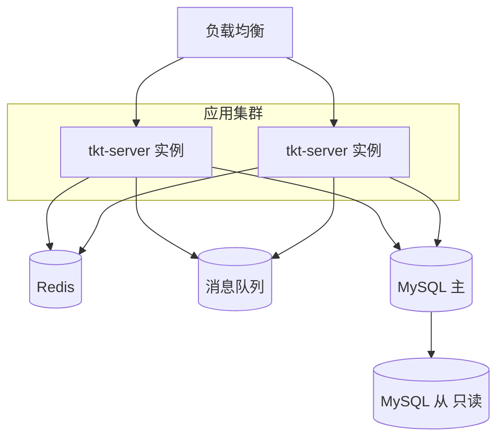
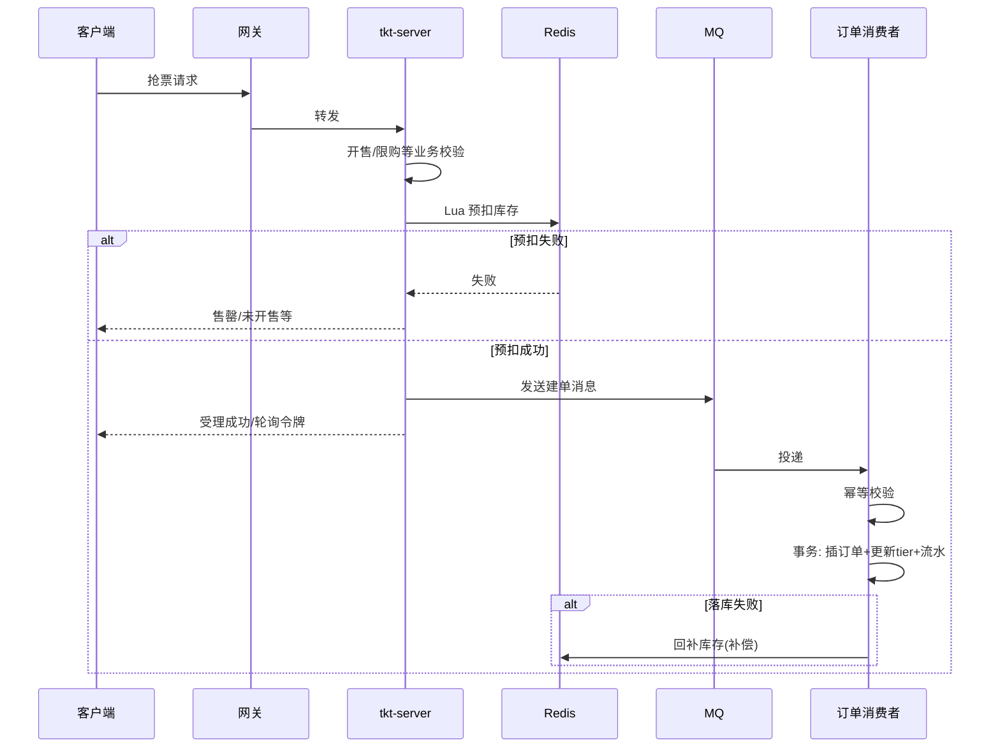
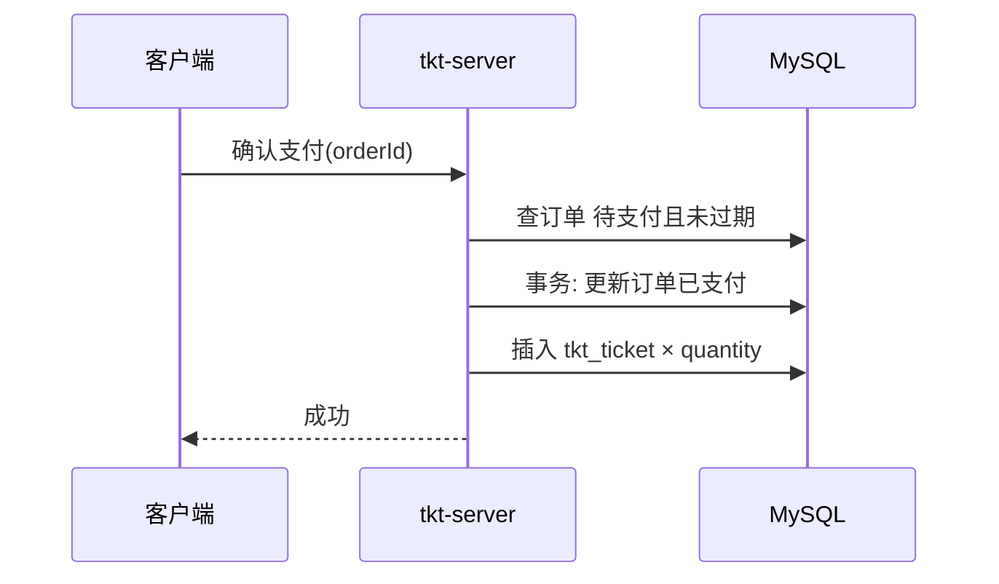
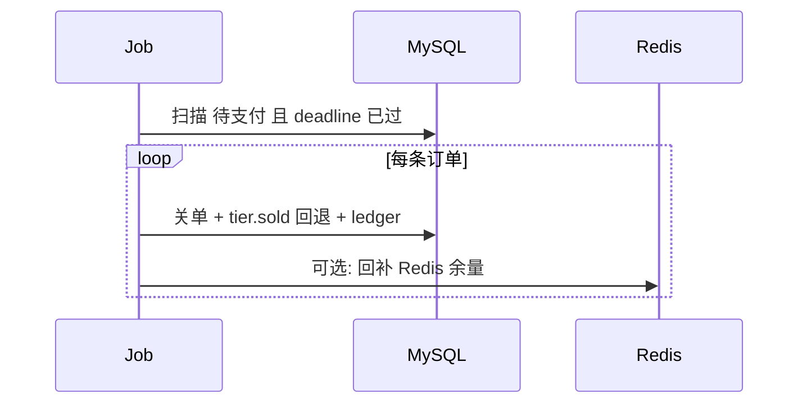
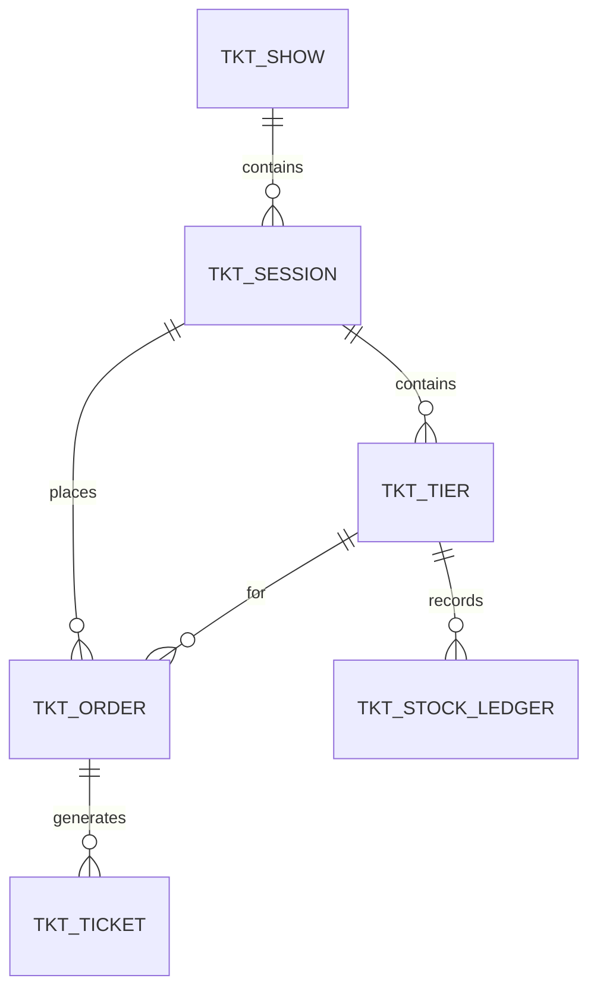

# 设计文档：高并发抢票票务平台（系统概要设计）

| 项 | 内容 |
| --- | --- |
| 文档版本 | v1.0 |
| 状态 | 草案 |
| 编写日期 | 2026-03-28 |
| 前置文档 | 《需求分析-高并发抢票票务平台.md》v2.0、《业务逻辑文档-抢票票务平台.md》v1.0、《数据库设计-抢票票务平台.md》v1.0、《技术文档-抢票票务平台.md》v1.0、`schema-ticket-mysql8.sql` |

---

## 1. 文档目的与定位

本文档是**系统级概要设计**：在需求与业务规则已定的前提下，给出**逻辑架构、领域划分、核心时序、接口与消息约定、错误码与配置项**，与《技术文档》中的选型及《数据库设计》中的表结构对齐，指导编码与联调。

| 文档 | 职责 |
| --- | --- |
| 需求分析 | 范围与优先级 |
| 业务逻辑 | 规则、状态机、公式 |
| 技术文档 | 技术栈、抗压策略、运维 |
| 数据库设计 | 表字段与索引 |
| **本文档** | **边界、模块、行为设计、交互契约** |

---

## 2. 系统边界与上下文

### 2.1 上下文（C4-Context 摘要）



- **系统外**：统一认证（可选）、真实支付渠道（首期不接入）、短信/邮件（可选）。  
- **系统内**：演出/场次/票档管理、抢票下单、订单与模拟支付、电子票、关单与对账任务。

### 2.2 首期范围（与需求一致）

- **票档级库存**，无选座；**模拟支付**；**支付超时关单释放库存**。  
- 不包含：选座、生产级支付清结算、多地多活。

---

## 3. 逻辑架构

### 3.1 分层视图

| 层级 | 职责 | 典型组件 |
| --- | --- | --- |
| 接入层 | TLS、路由、鉴权、限流 | API Gateway |
| 应用层 | 业务编排、参数校验、无状态 | `tkt-server` |
| 领域服务 | 订单、库存、票务聚合逻辑 | Service 层 |
| 基础设施 | 缓存、消息、DB、任务 | Redis、MQ、MySQL、Scheduler |

### 3.2 部署单元（逻辑）



定时任务可运行于独立 Pod 或与 `tkt-server` 同进程；**多实例时必须对关单/对账任务加分布式锁**，避免重复执行。

---

## 4. 领域与模块划分

### 4.1 限界上下文（首期）

| 上下文 | 职责 | 主要实体 |
| --- | --- | --- |
| 商品目录 | 演出、场次、票档配置与上下架 | Show、Session、Tier |
| 库存 | 票档可售数量、预扣、释放、流水 | Tier、StockLedger |
| 交易 | 订单、支付、关单 | Order |
| 履约 | 电子票生成与查询 | Ticket |

### 4.2 Maven 模块（对齐《通用架构设计与代码结构规范》）

```text
tkt/
├── tkt-api/          # 枚举、错误码、Feign/RPC API、DTO
└── tkt-server/       # Controller、Service、DAL、定时任务、MQ 消费者
```

### 4.3 包结构（建议）

```text
com.{company}.{project}.module.tkt/
├── controller/admin/show|session|tier|order/...
├── controller/app/show|session|order|pay|ticket/...
├── service/show|session|tier|order|ticket|stock/
├── job/                         # 关单、对账
├── mq/consumer/
└── dal/dataobject|mysql/
```

---

## 5. 核心时序设计

### 5.1 抢票（异步建单推荐路径）



### 5.2 模拟支付



### 5.3 超时关单（定时任务）



---

## 6. 接口设计约定（REST 风格）

以下为**资源与动词约定**，具体路径前缀、版本号以实现工程为准（如 `/app-api/tkt/v1`）。

### 6.1 C 端（App）

| 资源/操作 | 方法 | 说明 |
| --- | --- | --- |
| `/shows` | GET | 演出列表（分页） |
| `/shows/{id}` | GET | 演出详情 |
| `/sessions/{id}` | GET | 场次详情（含票档列表） |
| `/orders/grab` | POST | 抢票下单（body: sessionId, tierId, quantity, idempotencyKey） |
| `/orders/{orderNo}` | GET | 订单详情 |
| `/orders` | GET | 我的订单列表 |
| `/orders/{orderNo}/pay` | POST | 模拟支付 |
| `/tickets` | GET | 我的电子票列表 |

### 6.2 管理端（Admin）

遵循 CRUD 规范：演出、场次、票档的 **增删改查分页**；订单只读查询。  
权限标识建议：`tkt:show:*`、`tkt:session:*`、`tkt:tier:*`、`tkt:order:query`。

### 6.3 统一响应

- 使用 `CommonResult<T>`（与规范一致）；业务错误携带**错误码**（见第 9 节）。  
- 列表分页使用 `PageResult<T>`。

---

## 7. 消息队列设计

### 7.1 Topic

| Topic | 类型 | 说明 |
| --- | --- | --- |
| `TKT_ORDER_CREATE` | 普通消息 | 异步创建订单 |
| `TKT_ORDER_COMPENSATE` | 延迟/重试 | Redis 回补、人工介入（可选） |

### 7.2 建单消息体（逻辑字段）

| 字段 | 类型 | 必填 | 说明 |
| --- | --- | --- | --- |
| messageId | String | 是 | MQ 层唯一，用于去重 |
| userId | Long | 是 | |
| sessionId | Long | 是 | |
| tierId | Long | 是 | |
| quantity | Integer | 是 | |
| unitPriceCent | Integer | 是 | 快照，与消息同时刻一致 |
| idempotencyKey | String | 否 | 与订单表对应；空则依赖服务端防重 |
| redisToken | String | 否 | 预扣凭证/版本，用于失败回补 |

**消费语义**：至少一次；依赖 DB 唯一约束 + 业务幂等保证不重复建单。

---

## 8. Redis 设计（实现清单）

| Key | 类型 | 说明 |
| --- | --- | --- |
| `tkt:tier:remain:{tierId}` | String | 剩余张数，与 DB 对齐；Lua 扣减 |
| `tkt:user:qty:{userId}:{sessionId}:{tierId}` | String | 已占+待付+已付张数缓存（可选） |
| `tkt:job:close-order` | String | 分布式锁，关单任务 |
| `tkt:job:reconcile` | String | 分布式锁，对账任务 |

**语义**：开售前置或懒加载 `remain`；对账以 MySQL 为准修正 Redis。

---

## 9. 错误码设计（建议段）

在 `tkt-api` 中定义 `ErrorCodeConstants`，段内自增，示例：

| 码段用途 | 示例 |
| --- | --- |
| 演出/场次 | SHOW_NOT_EXISTS、SESSION_NOT_ON_SALE |
| 票档 | TIER_SOLD_OUT、TIER_OFFLINE |
| 订单 | ORDER_NOT_EXISTS、ORDER_EXPIRED、ORDER_STATUS_INVALID |
| 限购 | USER_BUY_LIMIT_EXCEEDED |
| 风控 | RATE_LIMIT_EXCEEDED |

具体数字与《项目全局错误码规范》一致（若有）。

---

## 10. 配置项（建议）

| Key | 含义 | 示例 |
| --- | --- | --- |
| `tkt.order.pay-timeout-minutes` | 支付倒计时分钟数 | 15 |
| `tkt.grab.async-poll-seconds` | 客户端轮询间隔建议（服务端可返回） | 1 |
| `tkt.job.close-order.batch-size` | 关单每批条数 | 100 |
| `tkt.cache.meta-ttl-seconds` | 演出/场次/票档元数据 Redis TTL | 604800（7 天） |

---

## 11. 数据设计摘要

### 11.1 ER（逻辑）



### 11.2 物理表

以《数据库设计》与 `schema-ticket-mysql8.sql` 为准；**订单唯一**：`uk_order_no`、`uk_order_idempotent`（注意 `idempotency_key` 为 NULL 时 MySQL 唯一索引不互斥多条 NULL）。

---

## 12. 关键算法与并发策略（设计级）

| 场景 | 策略 |
| --- | --- |
| 票档扣减 | Redis Lua 原子预扣 + DB `sold_stock` 乐观更新或条件 UPDATE |
| 不超卖 | `sold_stock + qty <= total_stock`；预扣失败则拒绝 |
| 关单 | 按 `order_status` + `pay_deadline` 索引批量扫描，小事务 |
| 幂等 | 客户端 idempotencyKey + DB 唯一索引；MQ messageId 去重表（可选） |

---

## 13. 非功能设计（摘要）

| 类别 | 设计要点 |
| --- | --- |
| 可用性 | 多实例 + LB；Redis/MQ 集群；MySQL 主从 |
| 性能 | 读走缓存与从库；写走主库 + MQ 削峰 |
| 安全 | HTTPS、RBAC、审计表 `tkt_admin_audit` |
| 可观测 | traceId 贯穿；指标与告警见《技术文档》 |

---

## 14. 测试设计要点（供用例设计）

| 类型 | 要点 |
| --- | --- |
| 功能 | 状态机迁移、关单后库存可再售、电子票张数=quantity |
| 并发 | 同票档多线程抢票不超卖；重复幂等键不重复下单 |
| 异常 | Redis 失败降级策略；MQ 堆积下用户体验 |

---

## 15. 未决事项与后续迭代

| 项 | 说明 |
| --- | --- |
| 异步建单返回形态 | 固定为「同步 + 轮询」或「仅返回 orderNo」需产品拍板 |
| 票档下架时待支付订单 | 允许继续支付 vs 批量关单，见《业务逻辑文档》 |
| 二期 | 选座、真实支付、退票 |

---

## 16. 文档修订

| 版本 | 日期 | 说明 |
| --- | --- | --- |
| v1.0 | 2026-03-28 | 首版 |

---

**文档结束**
